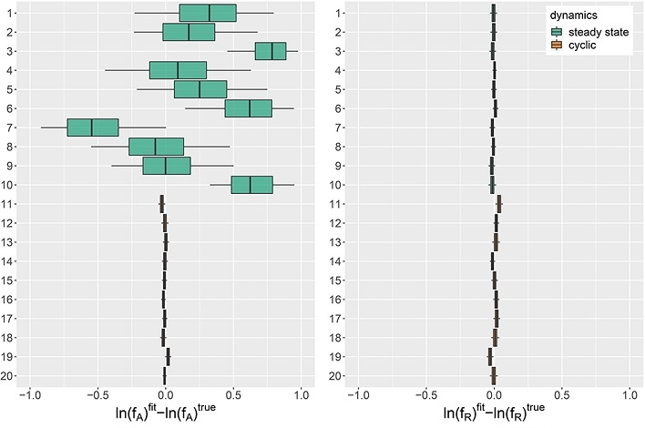

```{r setup, include=FALSE}
knitr::opts_chunk$set(echo = TRUE, message = FALSE,
                      fig.dim = c(8, 5))
library(tidyverse)
library(cowplot)
theme_set(
  theme_cowplot(font_size = 18) +
    theme(panel.background = element_rect(fill = "#fafafa"),
          plot.background = element_rect(fill = "#fafafa"))
)

set.seed(8202)
```

# Contenu du cours

- Révision: Comparaison et sélection de modèles

- Approche bayésienne pour la comparaison de modèles

- Comparaison de modèles avec *loo* et *brms*

- Plus d'exemples de modèles bayésiens en écologie

---

class: inverse, center, middle

# Comparaison et sélection de modèles

---

# Comparaison et sélection de modèles

- Différents modèles statistiques visant à expliquer les mêmes données: comment déterminer quel modèle représente le mieux le phénomène étudié? 

--

- Objectif: Optimiser la capacité du modèle à **prédire de nouvelles observations** du phénomène.


---

# Sous-ajustement et surajustement

- Modèle trop simple: erreur systématique, effets importants omis (biais, sous-ajustement).

--

- Modèle trop complexe: erreur aléatoire, représente les associations "accidentelles" d'un échantillon (variance, surajustement).

--

- Avec plus de données, on peut ajuster un modèle plus complexe.


---

# Ensemble de validation

- Mettre de côté une partie des données (~ 20 à 30%) pour évaluer la performance prédictive.

--

- Pas pratique sauf si l'échantillon est grand.

---

# Validation croisée

- Évaluer la performance prédictive sur de nouvelles observations tout en utilisant l'ensemble des données pour l'entraînement. 

--

- On divise aléatoirement les observations en groupes et on mesure la qualité des prédictions pour un groupe selon le modèle ajusté au reste des observations.

--

- Une observation par groupe (*leave-one-out cross-validation*); $k$ groupes (*k-fold cross-validation*).

--

- Méthode coûteuse en calcul, car il faut réajuster le modèle plusieurs fois.

---

# Critère d'information d'Akaike (AIC)

- Basé sur la théorie de l'information, produit des résultats consistents avec la validation croisée *leave-one-out* si l'échantillon est assez grand.

$$AIC = -2 \log L + 2 K$$

--

- Premier terme: ajustement aux données observées.

- Deuxième terme: pénalité pour la complexité du modèle.

---

# Comparaison de modèles avec l'AIC

- Seule la différence d'AIC entre modèles est interprétable.

$$\Delta AIC = AIC - \min AIC$$

--

- Rapport de plausibilité (*evidence ratio*) de chaque modèle vs. celui avec un AIC minimal.

$$e^{-\frac{\Delta AIC}{2} }$$

--

- Exemple: $\Delta AIC = 2$, rapport de 0.37 (~3 fois moins probable); $\Delta AIC = 10$, rapport de ~0.0067 (~150 fois moins probable).

---

# Prédictions multi-modèles

- Poids d'Akaike pour chacun des $m$ modèles candidats:

$$w_i = \frac{e^{\frac{-\Delta AIC_i}{2}}}{\sum_{j=1}^{m} e^{\frac{-\Delta AIC_j}{2}}}$$

--

- Prédiction d'une nouvelle observation $\tilde{y}$ basée sur la moyenne pondérée:

$$\tilde{y} = \sum_{j = 1}^m w_j \tilde{y_j}$$ 

--

- Les prédictions multi-modèles sont souvent plus précises que celles obtenues en considérant seulement le meilleur modèle, car elles tiennent compte de l'incertitude sur la forme du modèle.

---

class: inverse, center, middle

# Approche bayésienne pour la comparaison de modèles

---

# Densité prédictive

- Pour un modèle estimé par maximum de vraisemblance, prédictions obtenues en fixant les paramètres à leur valeur estimée.

- Vraisemblance de la nouvelle observation: $p(\tilde{y} | \hat{\theta})$. 

--

- Prédictions bayésiennes font la moyenne de $p(\tilde{y} | \theta)$ en fonction de la distribution *a posteriori* des $\theta$.

---

# Densité prédictive

$$p(\tilde{y} | y) = \int p(\tilde{y} | \theta) p(\theta | y) \text{d}\theta$$

--

- En pratique, avec $S$ vecteurs $\theta_{(1)}, ..., \theta_{(S)}$ tirés de la distribution *a posteriori* par un algorithme de Monte-Carlo: 

$$p(\tilde{y} | y) = \frac{1}{S} \sum_{j = 1}^S p(\tilde{y} | \theta_{(j)})$$

--

- Plus facile de travailler avec le logarithme de $p(\tilde{y} | y)$.

---

# Critères de sélection bayésiens

- On peut utiliser la validation croisée dans un contexte bayésien, mais l'ajustement répété du modèle est très coûteux.

--

- L'AIC s'applique mal: on ne connait pas le maximum de vraisemblance, les $K$ paramètres ne sont pas tout à fait libres en raison des contraintes.

---

# DIC

Critère d'information de la déviance:

$$DIC = -2 \log p(y | \bar{\theta}) + 2 p_D$$

- $\bar{\theta}$: moyenne *a posteriori* de $\theta$

- $p_D$: nombre effectif de paramètres

--

- Le plus proche de l'AIC, évalue les prédictions à une seule valeur de $\theta$ (pas une approche bayésienne).

---

# WAIC

Critère de Watanabe-Akaike (WAIC):

$$WAIC = -2 \sum_{i=1}^n \log \left( \frac{1}{S} \sum_{j = 1}^S p(y_i | \theta_{(j)}) \right) + 2 p_W$$ 

- Premier terme: densité prédictive conjointe des observations.

--

- Pénalité $p_W$: somme des variances du logarithme de la densité prédictive à chaque point:

$$p_W = \sum_{i=1}^n \text{Var}_j \left(\log p(y_i | \theta_{(j)}) \right)$$

--

- Calculé avec la fonction `waic` dans *brms*.

---

# PSIS-LOO

- PSIS = *Pareto smoothed importance sampling*, LOO = *leave-one-out*.

--

- Vise à estimer la densité prédictive qui serait obtenue par validation croisée *leave-one-out* pour chaque point, donc à partir du jeu de données $y_{-i}$ excluant le point $i$.

$$p(y_i | y_{-i}) = \int p(y_i | \theta) p(\theta | y_{-i}) \text{d}\theta$$ 

--

- Approximation basée sur la moyenne des $p(y | \theta_{(j)})$, mais avec une pondération particulière.

--

- Pondération ajustée pour que les poids extrêmes suivent un modèle théorique (distribution de Pareto).

---

# PSIS-LOO

- Implémentée dans le package R *loo*, accessible par la fonction `loo` dans *brms*.

--

- Diagnostic pour chaque point: l'ajustement des poids pour $y_i$ est une distribution de Pareto avec un paramètre $k$. Si $k > 0.7$, l'approximation est instable.

--

- On peut ensuite effectuer la validation croisée pour les observations $y_i$ problématiques seulement.

--

- Résultat de cette méthode: logarithme de la densité prédictive $elpd_{loo}$, soit la somme de $\log p(y_i | y_{-i})$.

- LOOIC: $-2 elpd_{loo}$ 

---

# Comparaison des méthodes

- PSIS-LOO plus précise que le WAIC, surtout pour les petits échantillons.

- WAIC plus rapide à calculer.

--

- Les deux méthodes basées sur la densité prédictive (WAIC et PSIS-LOO) sont préférées au DIC.

--

- Cependant, WAIC et PSIS-LOO supposent que les $y_i$ sont indépendants conditionnellement aux $\theta$. Ex.: pas de corrélation temporelle ou spatiale.

---

# Prédictions multi-modèles

$$\tilde{y} = \sum_{j = 1}^m w_j \tilde{y_j}$$ 

--

- Comme pour l'AIC, nous pourrions définir des poids selon les différences d'IC entre deux modèles (ex.: avec le WAIC ou LOOIC).

--

- Est-ce que des poids basés sur les rapports de plausibilité sont toujours optimaux (ex.: redondance entre modèles)?

---

# Superposition des modèles (*model stacking*)

$$\tilde{y} = \sum_{j = 1}^m w_j \tilde{y_j}$$ 

- Objectif: trouver les poids $w_j$ qui minimisent l'erreur de prédiction de la moyenne pondérée.

--

- Le package *loo* contient des méthodes pour calculer ces poids optimaux directement avec le résultat de la méthode PSIS-LOO (Yao et al. 2018).

---

class: inverse, center, middle

# Comparaison de modèles avec *loo* et *brms*

---

# Exemple

- Jeu de données `rikz` utilisé dans les cours précédents.

```{r, message = FALSE, warning = FALSE}
rikz <- read.csv("../donnees/rikz.csv")
rikz$Exposure <- as.factor(rikz$Exposure)
head(rikz)
```

---

# Modèles candidats

- Régression de Poisson pour la richesse spécifique en fonction de *NAP* et *Exposure*, avec un effet aléatoire de la plage sur l'ordonnée à l'origine.

.code60[
```{r, eval = FALSE}
library(brms)

rikz_prior <- c(set_prior("normal(0, 1)", class = "b"),
                set_prior("normal(2, 1)", class = "Intercept"),
                set_prior("normal(0, 0.5)", class = "sd"))

mod1 <- brm(Richness ~ NAP + Exposure + (1 | Beach), data = rikz, 
            family = poisson, prior = rikz_prior,
            control = list(adapt_delta = 0.99))
```
]

```{r, include = FALSE}
library(brms)
```

```{r, cache = TRUE, include = FALSE}
rikz_prior <- c(set_prior("normal(0, 1)", class = "b"),
                set_prior("normal(2, 1)", class = "Intercept"),
                set_prior("normal(0, 0.5)", class = "sd"))

mod1 <- brm(Richness ~ NAP + Exposure + (1 | Beach), data = rikz, 
            family = poisson, prior = rikz_prior,
            control = list(adapt_delta = 0.99))
```

--

- Modèle avec en plus un effet aléatoire de la plage sur le coefficient du *NAP*.

.code60[
```{r, eval = FALSE}
mod2 <- brm(Richness ~ NAP + Exposure + (1 + NAP | Beach), data = rikz, 
            family = poisson, prior = rikz_prior,
            control = list(adapt_delta = 0.99))
```
]

```{r, cache = TRUE, include = FALSE}
mod2 <- brm(Richness ~ NAP + Exposure + (1 + NAP | Beach), data = rikz, 
            family = poisson, prior = rikz_prior,
            control = list(adapt_delta = 0.99))
```

---

# Résultats des deux modèles 

.code60[
```{r}
posterior_summary(mod1, pars = "b|sd")
posterior_summary(mod2, pars = "b|sd")
```
]

---

# Calcul du LOOIC

```{r}
loo1 <- loo(mod1, mod2, compare = TRUE)
```

---

# Calcul du LOOIC

```{r}
loo1
```

---

# Recalcul des points problématiques

```{r, cache = TRUE}
loo_corr <- loo(mod1, mod2, compare = TRUE, reloo = TRUE)
loo_corr
```

---

# Résultat du WAIC

```{r}
waic(mod1, mod2, compare = TRUE)
```

---

# Comparaison avec le GLMM

- Au cours 5, l'AIC était plus faible pour le modèle 1 (effet aléatoire sur l'ordonnée à l'origine seulement).

--

- Dans l'approche bayésienne, les distributions *a priori* contraignent les valeurs des paramètres, donc un modèle plus complexe est moins surajusté. 

--

- Les prédictions des deux approches sont différentes.

--

- Ex.: Pour choisir d'inclure ou non un paramètre $\theta$, l'AIC compare les prédictions pour $\theta = \hat{\theta}$ avec celles pour $\theta = 0$.

--

- Les prédictions bayésiennes font la moyenne sur la distribution *a posteriori* de $\theta$, incluant des valeurs proches de 0 si elles sont probables.

---

# Superposition des modèles

- Résultat de `loo` contient un élément par modèle comparé et chaque élément contient une matrice `pointwise`.

.code60[
```{r}
head(loo1$mod1$pointwise)
```
]

--

- `elpd_loo`: valeur estimée de $\log p(y_i | y_{-i})$ pour chaque point $i$.

- `mcse_elpd_loo`: erreur-type de cette valeur.

---

# Superposition des modèles

- Fonction `stacking_weights` du package *loo*: déterminer les poids optimaux de superposition des modèles. 

--

- Requière une matrice avec la colonne `elpd_loo` de `pointwise` pour chaque modèle.

---

# Superposition des modèles

```{r, warning = FALSE, message = FALSE}
library(loo)
stacking_weights(cbind(loo1$mod1$pointwise[,1], loo1$mod2$pointwise[,1]))
stacking_weights(cbind(loo_corr$mod1$pointwise[,1], loo_corr$mod2$pointwise[,1]))
```

---

# Références

Vehtari, A., Gelman, A. et Gabry, J. (2017) Practical Bayesian model evaluation using leave-one-out cross-validation and WAIC. *Statistics and Computing* 27(5), 1413--1432. doi:10.1007/s11222-016-9696-4.

Yao, Y., Vehtari, A., Simpson, D. et Gelman, A. (2018) Using stacking to average Bayesian predictive distributions. Bayesian Analysis 13(3), 917--1007. doi:10.1214/17-BA1091.

---

class: inverse, center, middle

# Application: modèle prédateur-proie

---

# Application: modèle prédateur-proie

- Rosenbaum et al. (2019) Estimating parameters from multiple time series of population dynamics using bayesian inference.

- Système prédateur-proie-ressource dans un environnement contrôlé (chemostat).

--

- azote (ressource) -> algue (proie) -> rotifère (prédateur)

---

# Modèle

### Concentration d'azote $S$

$$\frac{dS}{dt} = \delta S^* - \frac{1}{c_A} \frac{f_A S}{h_A + S} A - \delta S$$

- Terme 1: Influx d'azote

--

- Terme 2: Consommation d'azote par les algues

--

- Terme 3: Flux de sortie

---

# Modèle

### Densité d'algues $A$

$$\frac{dA}{dt} = \frac{f_A S}{h_A + S} A - \frac{1}{c_R} \frac{f_R A}{h_R + A} R - \delta A$$

- Terme 1: consommation d'azote

- Terme 2: consommation d'algues par les rotifères

- Terme 3: flux de sortie

---

# Modèle

### Densité de rotifères $R$

$$\frac{dR}{dt} = \frac{f_R A}{h_R + A} R - \delta R$$

---

# Données 

- Mesures quotidiennes de $A$ et $R$ pour ~20 jours dans 18 réplicats. 

--

- Certains réplicats montrent des densités stables, d'autres montrent une dynamique cyclique.

--

- Les paramètres $\delta$, $S^*$, $h_A$ et $h_R$ sont connus. 

--

- Les taux de croissance maximaux, $f_A$ et $f_R$, ainsi que les facteurs de conversion, $c_A$ et $c_R$, sont à estimer. 

--

- Aussi à estimer: les valeurs $S_0$, $A_0$ et $R_0$ pour chaque réplicat au début de l'expérience.

---

# Modèle bayésien

- Effets aléatoires: le logarithme des paramètres $f_A$, $f_R$, $c_A$ et $c_R$ varie entre les réplicats, suivant une distribution normale.

--

- Pour une valeur donnée des paramètres, Stan résout numériquement les équations de $S$, $A$ et $R$. 

--

- Les observations de $A$ et $R$ suivent une distribution log-normale autour de leur vraie valeur, avec un écart-type à estimer.

--

- Tous les paramètres ont des distributions *a priori* avec contraintes légères (*weakly informative prior*) basées sur des expériences passées. 

---

# Simulations

- Ajustement du modèle à des données simulées à partir des distributions *a priori*. 

--

- But: Vérifier que les paramètres $f_A$, $f_R$, $c_A$ et $c_R$ sont identifiables.

--

- Résultat: excepté $f_R$, les autres paramètres sont difficiles à estimer lorsque les populations sont stables plutôt que cycliques.

---

# Simulations



*Source: Rosenbaum et al. 2019, Fig.1*

---

# Ajustement du modèle


*Source: Rosenbaum et al. 2019, Fig.3.*

---

# Ajustement du modèle

- Puisque la concentration d'azote $S$ n'était pas mesurée, la précision de son estimation dépend de la précision des paramètres du modèle. Elle est moins précise quand les populations sont stables plutôt que cycliques (réplicats 10 à 12).

--

- Le modèle suit plus précisément les observations des concentrations d'algues.

--

- Explication possible: le modèle est plus "flexible" pour la conversion azote-algues car l'azote n'est pas mesuré, comparativement à la conversion algues-rotifères où les deux niveaux sont mesurés.

---

class: inverse, center, middle

# Application: dispersion des graines et semis

---

# Application: dispersion des graines et semis

- Marchand et al. (2020) Seed-to-seedling transitions exhibit distance-dependent mortality but no strong spacing effects in a Neotropical forest.

--

- But: Estimer les courbes de dispersion de graines et de semis en fonction de la distance du parent.

---

# Données

- Parcelle de 50 ha du Smithsonian Tropical Research Institute (île Barro Colorado, Panama).

--

- Arbres d'un DHP >1cm cartographiés et mesurés aux 5 ans.

--

- Collecte annuelle des graines dans 500 capteurs (filets) et comptage des nouveaux semis dans des placettes près des capteurs.

--

- Modèle séparé pour chacune des principales espèces d'arbres.

---

# Modèle

- Nombre de graines dans le capteur $j$ lors de l'année $t$ suit une distribution binomiale négative, de moyenne:

$$\mu_{jt} = a \sum_i Q(b_{it}) F(r_{ij})$$

--

- $Q(b_{it})$: production de graines en fonction de la surface terrière de l'arbre $i$ à l'année $t$.

--

- $F(r_{ij})$: fonction de dispersion, probabilité qu'une graine tombe dans une surface de 1 m<sup>2</sup> située à distance $r_{ij}$.

--

- $a$: Aire du capteur.

---

# Modèle

Production de graines en fonction de la surface terrière:

$$Q(b_{it}) = e^{\beta_t} b_{it}$$

--

$$\beta_t \sim \text{N}(\mu_{\beta}, \sigma_{\beta})$$

---

# Modèle

Différentes fonctions de dispersion $F$


---

# Modèle

- Même modèle pour la dispersion des semis.

--

- Objectif: Déterminer la forme de la fonction de dispersion $F$ pour les graines et semis de différentes espèces, ainsi que le succès relatif de germination (rapport entre le nombre de semis et de graines) en fonction de la distance du parent.

---

# Problèmes

- Nous n'observons pas la dispersion sur de longues distances ou très courtes distances. L'ajustement des fonctions de dispersion sans contrainte peut produire des résultats extrêmes.

--

- Il est probable qu'aucune des fonctions de dispersion utilisées ne corresponde tout à fait à la réalité, donc nous voulons que les résultats tiennent compte de cette incertitude sur la forme de la fonction de dispersion.

---

# Approche bayésienne

- Superposition de modèles utilisant chacune des 5 fonctions de dispersion pour obtenir des prédictions multi-modèles de la courbe de dispersion et du succès de germination en fonction de la distance.

--

- Vérifications *a posteriori* pour éliminer les modèles très mal ajustés aux données.

--

- Distributions *a priori* pour les paramètres des fonctions de dispersion choisies pour que les valeurs plausibles de la distance médiane et moyenne de dispersion soient de l'ordre de 1 m à 1 km.

---

# Résultats


