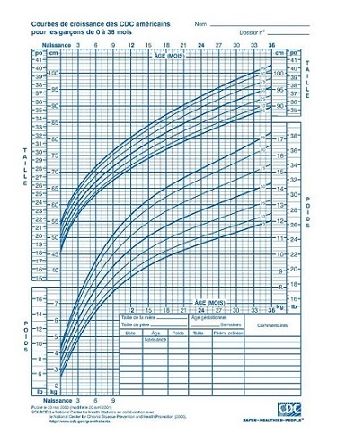

    
```{r setup, include=FALSE}
knitr::opts_chunk$set(echo = TRUE)
library(tidyverse)
library(cowplot)
```

# Introduction

Les modèles linéaires classiques -- test $t$, ANOVA et régression linéaire -- sont basés sur la comparaison des moyennes entre différents groupes ou différentes valeurs d'un prédicteur, avec une incertitude basée sur le calcul de la variance résiduelle. Les coefficients d'un modèle linéaire sont estimés par la méthode des moindres carrés, qui vise à minimiser cette variance résiduelle.

Ces méthodes sont conçues pour être optimales lorsque la variation résiduelle suit une distribution normale, qui prévoit relativement peu de valeurs extrêmes. La présence de quelques valeurs extrêmes exerce une forte influence sur les estimés produits par ces méthodes et rend difficile la détection des effets représentés par la plus grande partie des données. Dans ce cours, nous verrons plusieurs alternatives à la régression linéaire classique qui sont plus résistantes, ou *robustes*, à la présence de valeurs extrêmes.

## Contenu du cours

- Sensibilité aux valeurs extrêmes

- Régression robuste avec les M-estimateurs

- Régression $t$

- Régression quantile


# Sensibilité aux valeurs extrêmes

## Mesures de tendance centrale

Une mesure de tendance centrale vise à identifier le centre d'une distribution; la moyenne et la médiane en sont deux exemples bien connus. Le centre défini par la moyenne équilibre la *somme des écarts* de part et d'autre de la valeur moyenne, tandis que celui défini par la médiane équilibre le *nombre d'observations* de part et d'autre. Pour cette raison, l'ajout d'une valeur extrême à un échantillon peut affecter fortement sa moyenne, mais très peu sa médiane.

Par exemple, prenons les 10 valeurs suivantes sont la moyenne (44) et la médiane (43.5) sont approximativement égales:

`18 29 30 40 43 44 48 49 56 83`

Si on ajoutait la valeur 580 à cet échantillon, la nouvelle médiane serait de 44, tandis que la moyenne serait d'environ 93 et ne représenterait plus une valeur "typique" de l'échantillon.

## Point de rupture

Le point de rupture (*breakdown point*) d'un estimateur est défini par la question suivante: combien de valeurs extrêmes, si elles sont assez extrêmes, peuvent affecter sans limite la valeur de l'estimé? On l'exprime généralement comme une fraction du nombre d'observations.

Avec $n$ observations, la moyenne a un point de rupture de $1/n$, car une seule observation extrême suffit à l'entraîner vers des valeurs extrêmes. Dans l'exemple précédent, si on augmentait la valeur extrême ajoutée, la moyenne pourrait augmenter sans limite.

Dans le cas de la médiane, elle réagirait de la même façon à toute valeur extrême ajoutée d'un côté de la distribution, peu importe la magnitude de cette valeur extrême (la nouvelle médiane serait de 44 peu importe si la donnée ajoutée était de 100 ou 300 ou 1000). Pour faire augmenter la médiane sans limite, c'est toute la moitié supérieure du jeu de données qu'il faudrait faire augmenter; la médiane a donc un point de rupture de 0.5.

## Précision des estimés et valeurs extrêmes

Nous avons vu que la valeur de la moyenne est sensible à l'ajout de valeurs extrêmes d'un côté de la distribution (cas asymétrique). Si les valeurs extrêmes apparaissent de façon symétrique de part et d'autre de la moyenne, sa valeur reste inchangée. Cependant, puisque l'écart-type de la distribution est aussi sensible aux valeurs extrêmes, la précision avec laquelle on peut estimer de la moyenne est affectée.

Dans le graphique ci-dessous, la courbe verte représente une distribution normale centrée réduite, $y \sim N(0, 1)$. La courbe orange représente le mélange de deux distributions: 95% des observations proviennent de la distribution $N(0, 1)$ et 5% proviennent d'une distribution avec un écart-type plus grand: $N(0, 5)$. Ce mélange représente le cas où la plupart des observations suivent une distribution normale, sauf une petite fraction dont les valeurs sont plus extrêmes qu'attendu. Sur une échelle linéaire de la densité de probabilité $f(y)$ (à gauche), les deux distributions apparaissent très semblables. Sur une échelle logarithmique (à droite), on voit clairement que les valeurs extrêmes sont beaucoup plus probables pour la distribution de mélange (ex.: environ 30 fois plus probable d'obtenir $y = -4$ ou $y = 4$).

```{r, echo = FALSE}
p1 <- ggplot(NULL, aes(x = c(-4, 4))) +
    stat_function(fun = dnorm, geom = "line", color = "#1b9e77", size = 1) +
    stat_function(fun = function(x) 0.95*dnorm(x, 0 ,1) + 0.05*dnorm(x, 0, 5), geom = "line", color = "#d95f02", size = 1)
    

plot_grid(p1 + scale_y_continuous(expand = c(0, 0), limits = c(0, 0.4)) +
              labs(x = "y", y = "f(y)"),
          p1 + scale_y_log10() + labs(x = "y", y = "log f(y)"))
```

Comparons maintenant les erreurs-types pour la moyenne et la médiane de ces distributions. Pour ce faire, nous simulons 1000 échantillons de 100 observations de chacune des deux distributions; dans le cas de la distribution de mélange, l'écart-type est de 1 pour les 95 premières observations et de 5 pour les 5 dernières.

```{r}
set.seed(82)
norm_samp <- replicate(1000, rnorm(100)) # par défaut, mean = 0, sd = 1
mix_samp <- replicate(1000, rnorm(100, mean = 0, sd = c(rep(1, 95), rep(5, 5))))
```

Pour la distribution normale, l'erreur-type de la moyenne obtenue par simulation est d'environ 0.10, tel que prévu par la formule $\sigma / \sqrt{n} = 1 / \sqrt{100}$. Pour la distribution de mélange, l'erreur-type est environ 50% plus élevée (0.15).

```{r}
sd(apply(norm_samp, 2, mean))
sd(apply(mix_samp, 2, mean))
```

Quant à la médiane, son erreur-type est supérieure à celle de la moyenne pour la distribution normale, mais étant moins sensible (plus robuste) aux valeurs extrêmes, elle est estimée plus précisément pour la distribution de mélange.

```{r}
sd(apply(norm_samp, 2, median))
sd(apply(mix_samp, 2, median))
```

Qu'est-ce que ces résultats signifient? Supposons que nous comparons deux groupes entre lesquels la moyenne et la médiane d'une variable réponse diffèrent; si la distribution de la variable est symétrique, alors la moyenne est identique à la médiane pour chaque groupe. Si la variable suit une distribution normale, il est plus facile de détecter une différence entre les moyennes qu'entre les médianes; un test basé sur les moyennes, comme le test $t$, a une plus grande puissance. En présence de valeurs extrêmes, l'erreur-type de la moyenne augmente et un test basé sur la différence entre médianes pourrait être plus puissant.

Les M-estimateurs, que nous verrons plus loin dans un contexte de régression, sont des mesures de tendance centrale qui font un compromis entre l'efficacité de la moyenne pour une distribution normale et la robustesse aux valeurs extrêmes de la médiane. Lorsque la distribution est normale, la précision de ces estimateurs s'approche de celle de la moyenne, mais ils ont un point de rupture plus élevé et peuvent donc mieux conserver leur précision en présence de plusieurs valeurs extrêmes.

## Valeurs extrêmes et régression

Dans une régression linéaire simple, la moyenne de la réponse $y$ correspond à une fonction linéaire du prédicteur $x$, tandis que la variation aléatoire autour de cette moyenne est représentée par un résidu $\epsilon$ qui suit une distribution normale. 

$$y = \beta_0 + \beta_1 x + \epsilon$$

$$\epsilon \sim N(0, \sigma)$$

*Note*: Les concepts présentés ici s'appliquent autant à une régression linéaire multiple, mais le cas d'un prédicteur unique est plus simple à illustrer.

Les coefficients $\beta_0$ et $\beta_1$ sont estimés par la méthode des moindres carrés, c'est-à-dire qu'on vise à minimiser la somme des résidus au carré pour les $n$ observations:

$$\sum_{i=1}^n \hat{\epsilon_i}^2 = \sum_i^n \left( y_i - \hat{\beta_0} - \hat{\beta_1} x \right)^2$$

Ici $\hat{\epsilon_i}$ est l'estimé de la valeur du résidu $i$ en fonction de la valeur estimée des coefficients.

Pour une régression linéaire, l'influence d'une observation sur l'estimé des coefficients dépend de deux facteurs: la taille du résidu de cette observation, $\hat{\epsilon_i}$, ainsi que le positionnement de $x_i$. Pour un même $x_i$, les résidus $\hat{\epsilon_i}$ plus extrêmes ont une plus grande influence; pour une même taille de résidu, ceux correspondant à une valeur de $x_i$ plus extrême ont aussi une plus grande influence, comme le montre le graphique ci-dessous.

```{r, echo = FALSE}
df_rand <- data.frame(x = runif(20, 0, 10)) %>%
    mutate(y = 2*x + 5*rnorm(20) + 14)

df2 <- rbind(df_rand, data.frame(x = 6, y = 6))
p_df2 <- ggplot(df2, aes(x = x, y = y)) +
    geom_smooth(data = df_rand, method = "lm", se = FALSE, alpha = 0.1, color = "grey30", linetype = "dashed") +
    geom_smooth(method = "lm", se = FALSE, color = "#b3452c") +
    geom_point() +
    geom_point(aes(x = 6, y = 6), color = "#b3452c", size = 2) +
    scale_y_continuous(limits = c(0, 40))

df3 <- rbind(df_rand, data.frame(x = 12, y = 18))
p_df3 <- ggplot(df3, aes(x = x, y = y)) +
    geom_smooth(data = df_rand, method = "lm", se = FALSE, alpha = 0.1, color = "grey30", linetype = "dashed") +
    geom_smooth(method = "lm", se = FALSE, color = "#b3452c") +
    geom_point() +
    geom_point(aes(x = 12, y = 18), color = "#b3452c", size = 2) +
    scale_y_continuous(limits = c(0, 40))
plot_grid(p_df2, p_df3)
```

Dans les deux cas, le point en orange possède le même résidu, soit $\epsilon = -20$. Cependant, celui placé près de la limite supérieure de $x$ (panneau droit) affecte davantage l'estimé de la pente $\hat{\beta_1}$ (ligne orange = avec ce point; ligne grise pointillée = sans ce point). 

Les résidus situés près des extrêmes de $x$ exercent un grand effet de levier (*leverage*) sur la droite de régression. Puisque la droite de régression passe toujours par le centre de gravité du nuage de points, $(\bar{x}, \bar{y})$, un résidu situé plus loin du centre fait davantage "pivoter" la droite dans sa direction.

La **distance de Cook** mesure l'influence d'un point sur l'ajustement du modèle de régression; elle tient compte à la fois de la magnitude de $\hat{\epsilon_i}$ et de son effet de levier en fonction de la position en $x$. Généralement, une distance de Cook supérieure à 1 indique une observation ayant une grande influence.

## Exemple

Le jeu de données `Animals2` inclus avec le package *robustbase* contient des mesures de la masse corporelle (*body*, en kg) et de la masse du cerveau (*brain*, en g) pour 65 espèces animales. 

```{r}
library(robustbase)
data(Animals2)
str(Animals2)
```

La relation allométrique entre ces deux grandeurs est visible sur un graphique log-log.

```{r}
ggplot(Animals2, aes(x = body, y = brain)) +
    geom_point() +
    scale_x_log10() +
    scale_y_log10()
```

Tous les animaux dans ce jeu de données sont des mammifères, excepté trois qui sont des dinosaures. Il s'agit des trois observations avec la masse corporelle la plus grande, mais donc la masse du cerveau se retrouve sous la tendance générale. 

Dans une analyse statistique, les valeurs aberrantes (*outliers*) peuvent être exclues si nous avons des informations indépendantes indiquant que les mesures sont incorrectes, ou qu'elles proviennent d'une population différente du reste des observations. Puisqu'il est raisonnable de croire que la relation allométrique diffère entre les mammifères et les dinosaures, il serait justifié d'exclure ces derniers avant d'effectuer la régression. Pour les besoins du cours, nous supposerons qu'il n'y a pas de raison *a priori* d'exclure ces valeurs.

Une régression linéaire basée sur l'ensemble des données donne une pente de 0.59 pour *log(brain)* en fonction de *log(body)*.

```{r}
lm_ani <- lm(log(brain) ~ log(body), Animals2)
summary(lm_ani)
```

Dans les graphiques de diagnostic d'une régression, R indique automatiquement les numéros ou noms des rangées correspondant aux valeurs extrêmes. Dans ce cas-ci, chaque rangée du jeu de données est identifiée du nom de l'animal.

```{r, echo = FALSE}
par(mfrow = c(2,2))
plot(lm_ani)
par(mfrow = c(1,1))
```

Le 4e graphique, *Residuals vs. Leverage*, permet d'identifier les points avec une forte influence. Les lignes pointillées démarquent les seuils de 0.5 et 1 pour la distance de Cook. Ici, aucun des trois points extrêmes ne dépasse 1, mais leur influence est supérieure de beaucoup à celle du reste des points.

En comparaison, la régression ignorant les trois données extrêmes donne une pente de 0.75.

```{r}
summary(lm(log(brain) ~ log(body), Animals2[-c(6,16,26),]))
```

Le résultat des deux régressions est illustré dans le graphique suivant (courbe orange: avec dinosaures, courbe grise pointillée: sans dinosaures, région ombragée: intervalle de confiance).

```{r}
ggplot(Animals2, aes(x = body, y = brain)) +
    geom_smooth(data = Animals2[-c(6,16,26),], method = "lm", 
                alpha = 0.1, color = "grey30", linetype = "dashed") +
    geom_smooth(method = "lm", color = "#b3452c", fill = "#b3452c") +
    geom_point() +
    geom_point(data = Animals2[c(6,16,26),], color = "#b3452c", size = 2) +
    scale_x_log10() +
    scale_y_log10()
```

Dans les prochaines sections, nous verrons comment réduire l'influence des valeurs extrêmes sans les exclure complètement de l'analyse.


# Régression robuste avec les M-estimateurs

Les M-estimateurs sont des mesures de la tendance centrale conçues en fonction de deux objectifs:

- Offrir une meilleure robustesse aux valeurs extrêmes que la moyenne: point de rupture plus élevé et une erreur-type plus faible en présence de valeurs extrêmes.

- Avoir une erreur-type qui s'approche de celle de la moyenne lorsque la distribution est normale.

Puisqu'un modèle de régression vise à estimer la moyenne d'une variable réponse en fonction de prédicteurs, les M-estimateurs peuvent s'appliquer à ce type de modèle.

Dans le contexte d'une régression, le calcul d'un M-estimateur procède en assignant des poids à chaque résidu lors de l'application de la méthode des moindres carrés, afin de réduire le poids des résidus plus extrêmes.

Dans la méthode des moindres carrés pondérés, chaque observation a un poids $w_i$ et on cherche à minimiser:

$$\sum_{i=1}^n w_i^2 \hat{\epsilon_i}^2$$
 
Si tous les poids sont égaux à 1, on retrouve la méthode des moindres carrés.
 
Un des premiers M-estimateurs proposés a été celui de Huber, qui correspond aux poids $w_i = 1$ si $\vert \hat{\epsilon_i} \vert \le k$ et $w_i = k/\vert \hat{\epsilon_i} \vert$ si $\vert \hat{\epsilon_i} \vert > k$. Avec cette méthode, tous les résidus inférieurs à $-k$ ou supérieurs à $k$ comptent comme des résidus égaux à $-k$ ou $k$, respectivement, pour le calcul des coefficients de la régression.

Le bipoids de Tukey (*Tukey's biweight*) est un autre M-estimateur, qui correspond aux poids $w_i = (1 - (\hat{\epsilon_i}/k)^2)^2$ si $\vert \hat{\epsilon_i} \vert \le k$ et $w_i = 0$ si $\vert \hat{\epsilon_i} \vert > k$. Cet estimateur donne donc un poids inférieur à 1 à tous les résidus; ce poids diminue avec la magnitude du résidu pour atteindre 0 si le résidu est inférieur à $-k$ ou supérieur à $k$, ce qui équivaut à exclure complètement les résidus de cette magnitude.

Les valeurs de $k$ utilisées le plus couramment sont $k = 1.345\hat{\sigma}$ pour la méthode de Huber et $k = 4.685\hat{\sigma}$ pour le bipoids de Tukey. Ici, $\hat{\sigma}$ est un estimé robuste de l'écart-type des données, dont nous ne discuterons pas dans ce cours. Ces valeurs de $k$ sont choisies afin que l'erreur-type des estimés soit au plus 5% au-dessus de celle obtenue par le modèle classique si la distribution des résidus est normale.

Le graphique ci-dessous montre le poids accordé pour chacune des deux méthodes en fonction du résidu normalisé par $\sigma$.

```{r, echo = FALSE}
ggplot(data = NULL, aes(x = c(-6, 6))) +
    labs(x = expression(epsilon[i]/sigma), y = expression(w[i])) +
    stat_function(fun = function(x) ifelse(x >= -1.345 & x <= 1.345, 1, 1.345/abs(x)), geom = "line", aes(color = "Huber"), size = 1) +
    stat_function(fun = function(x) ifelse(x>= -4.685 & x <= 4.685, (1 - (x/4.685)^2)^2, 0), geom = "line", aes(color = "Tukey"), size = 1) +
    scale_y_continuous(limits = c(0, 1), expand = c(0, 0)) +
    scale_color_manual(name = "Méthode", 
         values = c("Huber"="#1b9e77","Tukey"="#d95f02"))
```

Pour estimer les coefficients d'une régression robuste avec les M-estimateurs, il faut minimiser la somme des carrés des résidus en fonction de poids qui dépendent eux-mêmes des résidus. Afin de résoudre ce problème, l'algorithme utilisé procède par itération (*iterative reweighted least squares* ou IRLS): 

- On commence avec une première valeur proposée pour chaque coefficient, puis on calcule les résidus et les poids. 

- On ré-estime les coefficients en minimisant la somme des carrés des résidus pondérés, puis on révise la valeur des résidus et des poids selon ces nouveaux coefficients.

- On répète l'étape précédente jusqu'à ce que les poids demeurent stables d'une itération à l'autre selon la précision voulue.

Parmi les deux méthodes mentionnées, le bipoids de Tukey tolère mieux les valeurs extrêmes avec grand effet de levier. Cependant, son résultat peut dépendre des valeurs initiales proposées par l'algorithme. La méthode d'estimation "MM" est une variation du M-estimateur qui utilise une autre technique robuste afin de fournir des valeurs initiales au M-estimateur avec bipoids de Tukey. La fonction de régression linéaire robuste `lmrob` du package *robustbase* utilise la méthode MM comme choix par défaut.

Voici le résultat de `lmrob` appliquée au jeu de données *Animals2* vu précédemment. La première partie du sommaire des résultats ressemble au tableau obtenu avec `lm` (estimé des coefficients, erreur-type et test de signification). Ensuite, on obtient un sommaire des poids calculées, puis  la liste des paramètres de l'algorithme.

```{r}
lmrob_ani <- lmrob(log(brain) ~ log(body), Animals2)
summary(lmrob_ani)
```

La fonction `weights` permet de consulter les poids associés à chaque observation.

```{r}
ggplot(data = NULL, aes(x = rownames(Animals2), 
                        y = weights(lmrob_ani, type = "robustness"))) +
    geom_point() +
    coord_flip() + # inverse la position des axes x et y
    theme_bw()
```

Notez que les trois espèces de dinosaures ont reçu un poids nul, avec pour résultat que la droite de régression est à peu près identique à celle obtenue avec `lm` en excluant ces trois espèces.

```{r}
ggplot(Animals2, aes(x = body, y = brain)) +
    geom_smooth(data = Animals2[-c(6,16,26),], method = "lm", 
                alpha = 0.1, color = "grey30", linetype = "dashed") +
    geom_smooth(method = "lmrob", color = "#b3452c", fill = "#b3452c") +
    geom_point() +
    geom_point(data = Animals2[c(6,16,26),], color = "#b3452c", size = 2) +
    scale_x_log10() +
    scale_y_log10()
```

## Extension aux modèles linéaires généralisés

Le package *robustbase* contient aussi une fonction `glmrob`. Celles-ci applique différentes méthodes semblables aux M-estimateurs pour produire des estimés robustes des coefficients de modèles linéaires généralisés (GLM).


# Régression $t$

Les méthodes présentées dans la section précédente ne sont pas basées sur une forme spécifique de la distribution des résidus autour de la moyenne de $y$, ce qui contribue à leur généralité. 

Toutefois, certaines approches de modélisation, comme le maximum de vraisemblance vu au dernier cours et les méthodes bayésiennes présentées plus tard cette session, requièrent de spécifier une distribution pour toutes les variables aléatoires du modèle. Dans ce cas, si on souhaite assigner à une variable une distribution semblable à la normale, mais qui permet davantage de valeurs extrêmes, nous pouvons avoir recours à la distribution $t$.

*Rappel*: Dans les cours de statistiques, la distribution $t$ de Student est d'abord présentée comme une façon d'estimer la distribution de la moyenne d'un échantillon $\bar{x}$ lorsque la variance de la population est inconnue. Pour un échantillon de $n$ observations, si $\sqrt{n}(\bar{x} - \mu)/\sigma$ suit une distribution normale centrée réduite et qu'on remplace $\sigma$ par son estimé $s$ à partir de l'échantillon, alors $\sqrt{n}(\bar{x} - \mu)/s$ suit une distribution $t$ avec $n-1$ degrés de liberté. 

Même à variance égale, la distribution $t$ contient plus de valeurs extrêmes que la distribution normale. Cet effet est plus prononcé lorsque le nombre de degrés de liberté est faible: si $df \le 2$, il y a tant de valeurs extrêmes que la variance ne peut pas être définie. À l'opposé, la distribution $t$ s'approche d'une distribution normale si le nombre de degrés de liberté est élevé.

Voici par exemple le graphique des distributions $t$ à 3 et 6 degrés de liberté, comparées à une distribution normale centrée réduite. Sur l'échelle logarithmique, on voit que les résidus à $\pm 4$ sont environ 100 fois plus probables pour la distribution $t$ à 3 degrés de liberté que pour la distribution normale.

```{r, echo = FALSE}
p_t_norm <- ggplot(data = NULL, aes(x = c(-4, 4))) +
    labs(x = "y", y = "f(y)") +
    stat_function(fun = dnorm, geom = "line", aes(color = "Normal"), size = 1) +
    stat_function(fun = dt, args = list(df = 3), geom = "line", aes(color = "t(df=3)"), size = 1) +
    stat_function(fun = dt, args = list(df = 6), geom = "line", aes(color = "t(df=6)"), size = 1) +
    scale_color_manual(name = "Distribution", 
                       values =c("Normal"="#1b9e77","t(df=6)"="#d95f02",
                                 "t(df=3)"="#7570b3"),
                       breaks = c("Normal", "t(df=6)", "t(df=3)"))
plot_grid(p_t_norm + scale_y_continuous(expand = c(0, 0), limits = c(0, 0.4)) + labs(x = "y", y = "f(y)") + theme(legend.position = "none"),
          p_t_norm + scale_y_log10() + labs(x = "y", y = "log f(y)"), rel_widths = c(4, 6))
```

De façon plus générale, la distribution $t$ peut servir à modéliser la variation résiduelle dans tout modèle où on veut prévoir davantage de valeurs extrêmes que prévues par la distribution normale. 

La fonction `tlm` du package *hett* ajuste un modèle de régression linéaire où les résidus suivent une distribution $t$, estimant à la fois les coefficients de la régression et le nombre de degrés de liberté de la distribution $t$. En l'appliquant au jeu de données *Animals2*, nous obtenons des résultats comparables (en tenant compte de la marge d'erreur) à ceux obtenus dans la section précédente avec `lmrob`.

```{r, warning = FALSE, message = FALSE}
library(hett)
treg <- tlm(log(brain) ~ log(body), data = Animals2)
summary(treg)
```

L'estimé du nombre de degrés de liberté est de 3. Cependant, notez que le nombre de degrés de liberté est difficile à estimer précisément et la fonction `tlm` n'offre pas d'intervalle de confiance pour cette valeur.


# Régression quantile

Au début du cours, nous avions présenté la médiane comme un exemple de statistique robuste aux valeurs extrêmes. Par définition, la probabilité qu'une variable $y$ soit inférieure ou égale à sa médiane est de 50%; la médiane est donc un *quantile* associé à une probabilité cumulative de 0.5. Les quantiles autres que la médiane sont aussi des statistiques robustes, bien que leur point de rupture soit moins élevé. Par exemple, un quantile associé à une probabilité de 0.1 ou 0.9 a un point de rupture correspondant à 10% de valeurs extrêmes.

Plutôt que de modéliser la moyenne d'une variable réponse en fonction de prédicteurs, la régression quantile modélise un ou plusieurs quantiles de la réponse en fonction des mêmes prédicteurs. Il peut donc s'agir d'une méthode de régression robuste si on remplace la moyenne par la médiane, mais la régression quantile a d'autres utilités:

- Modéliser une variable réponse dont la variance n'est pas homogène; dans ce cas, la distance entre les quantiles varie en fonction de la valeur des prédicteurs. Un exemple bien connu de régression quantile est la courbe de croissance des enfants qui représente différents quantiles de la distribution de taille ou de poids en fonction de l'âge.



- Représenter un cas où un prédicteur influence les extrêmes de la distribution davantage que son centre. Comme l'explique l'article de Cade et Noon (2003) cité dans les références, cette dernière application est utile dans le cas de systèmes complexes où la réponse est parfois limitée par les facteurs mesurés, parfois par d'autres facteurs non-mesurés. Dans ce cas, le prédicteur limite le "plafond" de la réponse, mais exerce moins de contrôle sur son "plancher" si d'autres facteurs sont alors limitants, tel qu'illustré dans le graphique ci-dessous.

```{r, echo = FALSE}
df_limit <- data.frame(x = runif(100, 0, 10), y = runif(100, 0, 20))
df_limit <- filter(df_limit, y < 3*x)

ggplot(df_limit, aes(x = x, y = y)) +
    geom_point()
```
 
Nous utiliserons la fonction `rq` du package *quantreg* pour effectuer une régression quantile. 

Le jeu de données `Mammals` inclus avec ce package montre la vitesse maximale connue (en km/h) de mammifères en fonction de leur poids. Puisque l'échelle de poids varie sur plusieurs ordres de grandeur, il est plus utile de représenter son logarithme.

```{r, warning = FALSE, message = FALSE}
library(quantreg)
data(Mammals)
ggplot(Mammals, aes(x = log(weight), y = speed)) +
    geom_point()
```

D'après ce graphique, il semble que le poids pourrait agir comme facteur limitant pour la vitesse des mammifères, donc son effet devrait être davantage ressenti sur les quantiles élevés de la distribution.

Pour exécuter une régression quantile `rq`, on spécifie la formule du modèle et le jeu de données source `data` comme dans une régression linéaire. Entre ces deux arguments, nous devons aussi spécifier dans l'argument `tau` quels quantiles seront modélisés. Ici, nous modéliserons les 1er et 9e déciles (0.1 et 0.9), les 1er et 3e quartiles (0.25 et 0.75) ainsi que la médiane.

```{r}
qreg <- rq(speed ~ log(weight), tau = c(0.10, 0.25, 0.5, 0.75, 0.9), 
           data = Mammals)
```

Le sommaire du résultat présente les coefficients de la régression et leur intervalle de confiance pour chaque quantile.

```{r}
summary(qreg)
```

En appliquant la fonction `plot` à ce sommaire, nous pouvons voir la tendance de chaque coefficient du modèle en fonction des quantiles. À titre de comparaison, l'estimé du coefficient pour la moyenne (modèle linéaire `lm`) est représenté par une ligne rouge, avec un intervalle de confiance en pointillé.

```{r}
plot(summary(qreg))
```

La fonction `predict` appliquée au résultat produit une matrice, où chaque rangée correspond à la rangée correspondante des données originales et chaque colonne représente la prédiction des quantiles de la réponse (dans l'ordre) pour une rangée donnée. 

```{r}
qpred <- predict(qreg)
head(qpred)
```

Pour visualiser rapidement le résultat d'une régression quantile avec un prédicteur, nous pouvons faire appel à la fonction `geom_quantile` de *ggplot2*.

```{r}
ggplot(Mammals, aes(x = weight, y = speed)) +
    geom_point() +
    geom_quantile(quantiles = c(0.1, 0.25, 0.5, 0.75, 0.9), color = "#b3452c") +
    scale_x_log10()
```


# Résumé

- La moyenne et la variance sont des statistiques sensibles aux valeurs extrêmes. 

- Pour une régression linéaire, l'influence d'une observation augmente si son résidu est grand (valeur extrême de $y$) ou si elle a un grand effet de levier (valeur extrême de $x$). La distance de Cook mesure l'effet combiné de ces deux facteurs.

- La régression robuste basée sur les M-estimateurs (fonction `lmrob` du package *robustbase*) produit des estimés presque aussi précis que la régression linéaire si les suppositions de celle-ci sont respectées, tout en étant beaucoup moins sensibles à la présence de quelques valeurs extrêmes.

- La distribution $t$ offre une méthode paramétrique pour représenter une variable comportant davantage de valeurs extrêmes que la distribution normale. La fonction `tlm` du package *hett* ajuste un modèle de régression linéaire où la réponse suit une distribution $t$ plutôt que normale autour de sa valeur moyenne.

- La régression quantile modélise l'effet d'un prédicteur sur différents quantiles de la distribution de la réponse. 


# Références

- Cade, B.S. et Noon, B.R. (2003) A gentle introduction to quantile regression for ecologists. *Frontiers in Ecology and the Environment* 1: 412--420.

- Fox, J. (2002) Robust Regression. Appendix to *An R and S-PLUS Companion to Applied Regression*. Sage Publications, Thousands Oaks, USA.

