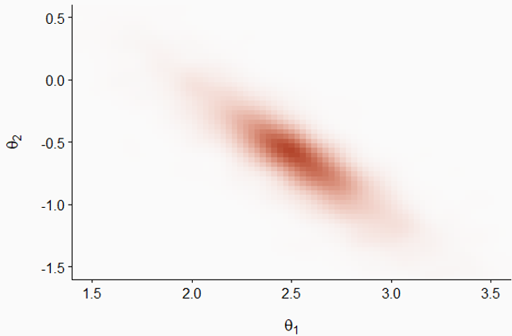
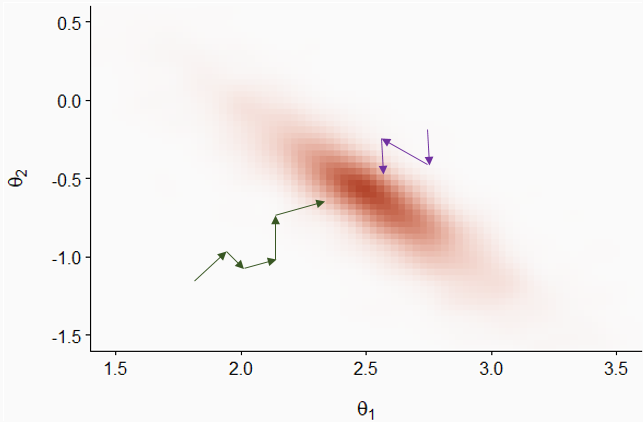
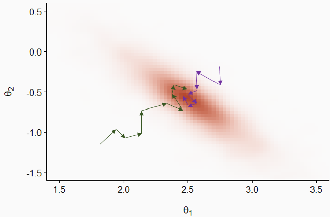
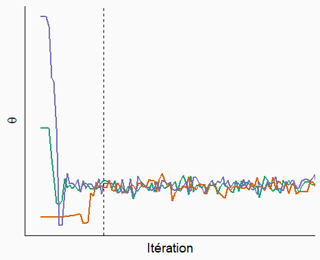

```{r setup, include=FALSE}
knitr::opts_chunk$set(echo = TRUE)
library(tidyverse)
library(cowplot)
theme_set(theme_cowplot())
```

# Introduction

Le cours d'aujourd'hui couvre d'abord les méthodes de Monte-Carlo par chaînes de Markov, une famille d'algorithmes permettant d'appliquer l'inférence bayésienne à des modèles complexes. Nous parlerons spécifiquement de la plateforme Stan, qui possède certains avantages uniques par rapport à d'autres logiciels en raison de son implémentation de l'algorithme de Monte-Carlo hamiltonien. Nous présenterons ensuite un protocole pour le développement de modèle hiérarchiques bayésiens; ce protocole sera ensuite appliqué à un exemple déjà vu dans le cours sur les modèles linéaires généralisés à effets mixtes (GLMM).

# Contenu du cours

- Méthodes de Monte-Carlo par chaînes de Markov

- Plateforme Stan pour l'inférence bayésienne

- Étapes de développement d'un modèle hiérarchique bayésien

- GLMM bayésien avec brms


# Méthodes de Monte-Carlo par chaînes de Markov

Lors du dernier cours, nous avons vu l'application du théorème de Bayes pour estimer la distribution *a posteriori* des paramètres $\theta$ d'un modèle en fonction d'observations $y$.

$$p(\theta | y) = \frac{p(y | \theta) p(\theta)}{p(y)}$$

Dans cette équation, $p(\theta)$ est la distribution de probabilité *a priori* de $\theta$ (représentant leur incertitude avant d'avoir observé les données), tandis que $p(y | \theta)$ est la probabilité des observations $y$ conditionnelle à une valeur de $\theta$, autrement dit la fonction de vraisemblance.

Avec plusieurs paramètres, $\theta$ est un vecteur, donc la distribution *a posteriori* résultant est la distribution conjointe des $\theta$ en fonction des données. Il est important de considérer cette distribution conjointe, car les valeurs les plus probables pour un paramètre peuvent dépendre de la valeur des autres paramètres.

Dans l'équation ci-dessous, le dénominateur $p(y)$ est la probabilité marginale des données. Puisqu'elle ne dépend pas de $\theta$, cette probabilité peut être vue comme une constante de normalisation nécessaire pour que l'intégrale de la distribution de probabilité *a posteriori* soit égale à 1. 

Nous avons aussi vu que $p(y)$ correspond à l'intégrale du numérateur $p(y | \theta) p(\theta)$ pour toutes les valeurs possibles de $\theta$. Excepté dans des cas simples, on ne peut pas calculer exactement cette intégrale pour obtenir une formule mathématique de $p(\theta | y)$.

Pour résoudre ce problème, nous ferons appel aux méthodes de Monte-Carlo. Comme nous avons vu dans le premier cours de la session, il s'agit de méthodes pour approximer une distribution en simulant un échantillon de cette distribution.

Il ne semble pas possible de simuler des échantillons de la  distribution $p(\theta | y)$ si nous ne connaissons pas $p(y)$. Toutefois, puisque $p(y)$ ne dépend pas de $\theta$, il est possible de calculer le *rapport* des probabilités *a posteriori* de deux vecteurs $\theta$:

$$\frac{p(\theta_{(2)} | y)}{p(\theta_{(1)} | y)} = \frac{p(y | \theta_{(2)}) p(\theta_{(2)})}{p(y | \theta_{(1)}) p(\theta_{(1)})}$$

*Note*: Ici, nous utilisons des indices entre parenthèses pour représenter différents vecteurs $\theta$, afin d'éviter de confondre avec les différents éléments d'un seul vecteur, ex.: si $\theta$ est un vecteur de $m$ paramètres, $\theta_{(1)} = (\theta_{1(1)}, \theta_{2(1)}, ... \theta_{m(1)})$.

## Algorithme de Metropolis-Hastings

L'algorithme de Metropolis-Hastings permet de générer un échantillon de la distribution $p(\theta | y)$ à partir de ces rapports de probabilité. Voici un résumé du fonctionnement de cette méthode.

1. Tout d'abord, on choisit aléatoirement un premier vecteur de paramètres $\theta_{(1)}$.

2. Ensuite, on choisit un deuxième vecteur $\theta_{(2)}$, qui dépend de $\theta_{(1)}$ selon une certaine probabilité de transition. Par exemple, chacun des paramètres de $\theta_{(1)}$ est déplacé d'une quantité tirée d'une distribution aléatoire normale.

3. On calcule le rapport des probabilités *a posteriori* $\frac{p(\theta_{(2)} | y)}{p(\theta_{(1)} | y)}$.

    + Si le rapport est plus grand ou égal à 1 ($\theta_{(2)}$ est plus probable que $\theta_{(1)}$), on accepte $\theta_{(2)}$.

    + Si le rapport est plus petit que 1, on accepte $\theta_{(2)}$ avec une probabilité égale à ce rapport; sinon, on reste au même point donc $\theta_{(2)} = \theta_{(1)}$.

Les étapes 2 et 3 sont répétées pour le nombre d'itérations voulues.

Il a été démontré qu'avec suffisamment d'itérations, la distribution des $\theta_{(i)}$ s'approche aussi près que voulu de la distribution recherchée: $p(\theta | y)$. Ce résultat théorique dépend en fait de certaines conditions; cependant, nous ne discuterons pas de ces détails ici, car nous sommes intéressés non pas à savoir si l'algorithme converge éventuellement, mais s'il converge assez rapidement pour être utile en pratique. Cela dépend du problème et il faudra déterminer empiriquement la convergence en inspectant les résultats de l'inférence, comme nous verrons plus loin.

## Chaînes de Markov

Dans l'algorithme de Metropolis-Hastings, chaque vecteur $\theta_{(i+1)}$ est un vecteur aléatoire qui dépend de $\theta_{(i)}$. En théorie des probabilités, ce type de séquence est nommé chaîne de Markov. Cet algorithme est donc à la base des méthodes de Monte-Carlo par chaînes de Markov (*Markov chain Monte Carlo* en anglais, souvent abbrévié MCMC).

Pour illustrer la progression d'une chaîne de Markov, prenons l'exemple ci-dessous qui représente la distribution conjointe de deux paramètres $\theta_1$ et $\theta_2$; les régions plus foncées représentent une plus grande densité de probabilité. Notez que les deux distributions sont corrélées: plus $\theta_1$ est grand, plus il est probable que $\theta_2$ soit petit et vice versa.



Dans le graphique suivant, les flèches vertes et mauves représentent deux chaînes de Markov initialisées à des positions aléatoires différentes. Bien que les transitions soient aléatoires, la probabilité d'accepter une transition est plus grande lorsque la densité de probabilité *a posteriori* est plus élevée, donc les chaînes s'approchent graduellement de la partie principale de la distribution.



Après cette période initiale, les deux chaînes explorent la distribution et la  probabilité que chaque point $(\theta_1, \theta_2)$ soit visité par une chaîne est proportionnelle à la densité de probabilité *a posteriori*.



Considérons maintenant les séquences de valeurs d'un paramètre $\theta$ visitées par trois chaînes de Markov, telles qu'illustrées dans le graphique ci-dessous.



Au départ, les chaînes doivent partir de leur points initiaux respectifs et s'approcher de la partie principale de la distribution. Il s'agit de la période de rodage (appelée *burn-in* ou *warmup* en anglais). Les valeurs du paramètre durant la période de rodage ne sont pas retenues pour l'inférence. Après la ligne pointillée, on voit que les chaînes ont convergé et se sont mélangées. Il s'agit de la période d'échantillonnage qui sera utilisée pour approximer la distribution *a posteriori* du paramètre. 

## Vérification de la convergence des chaînes

Comme nous avons vu ci-dessus, l'inspection du tracé des chaînes (*trace plot* en anglais) peut nous indiquer si différentes chaînes de Markov ont convergé, ce qui signifie que leurs valeurs peuvent être utilisées pour estimer la distribution *a posteriori*.

Pour déterminer de façon plus quantitative la convergence, nous pouvons utiliser la statistique de Gelman-Rubin, dénotée $\hat{R}$. Cette statistique représente la variance d'un paramètre entre les chaînes relative à la variance du paramètre dans chaque chaîne. Cette statistique est conceptuellement semblable à une ANOVA: si les chaînes explorent la même distribution, alors le niveau de variation entre valeurs d'une même chaîne est semblable à la variation entre valeurs de chaînes différentes.

À la convergence, $\hat{R}$ doit être d'environ 1. Il n'y a pas de seuil définitif pour cette valeur, mais la plupart des auteurs s'entendent pour dire que $\hat{R}$ ne devrait pas dépasser 1.1. Néanmoins, $\hat{R} \leq 1.1$ ne garantit pas la convergence vers la bonne distribution; nous verrons plus tard d'autres diagnostics visant à confirmer que l'algorithme explore bien la distribution *a posteriori*.

En cas de problème de convergence, nous pouvons allonger la période de rodage. Si la convergence est beaucoup trop lente ou que chaque chaîne reste "prise" dans une partie de la distribution plutôt que de se mélanger aux autres chaînes, cela pourrait indiquer une difficulté d'estimation des paramètres du modèle avec les données fournies. Dans ce cas, il serait utile de reparamétriser ou modifier le modèle.

## Efficacité de l'échantillonnage

Si l'algorithme converge, nous pouvons quantifier l'efficacité avec laquelle les chaînes de Markov approximent notre distribution *a posteriori*. 

Considérons une fonction $f$ calculée à partir des paramètres du modèle. Il peut s'agir de la moyenne du paramètre, d'un quantile, ou de toute statistique d'intérêt qui dépend d'un ou plusieurs paramètres du modèle. Si on avait un échantillon de $N$ tirages aléatoires **indépendants** de la distribution conjointe *a posteriori* des paramètres, alors la valeur de $f$ calculée à partir de cet échantillon s'approcherait de sa valeur pour la distribution exacte, avec une erreur d'approximation (erreur-type de Monte-Carlo) proportionnelle à $1/\sqrt{N}$.

*Note*: Il ne faut pas confondre l'erreur-type de Monte-Carlo avec l'écart-type de la distribution *a posteriori* du paramètre. L'écart-type de la distribution *a posteriori* (semblable à l'erreur-type pour un estimateur fréquentiste) représente l'incertitude sur la valeur du paramètre et dépend (notamment) de la quantité d'observations. L'erreur-type de Monte-Carlo est l'erreur d'approximation numérique de l'algorithme. En augmentant le nombre d'itérations, nous pouvons estimer plus précisément toutes les propriétés de la distribution *a posteriori*, incluant son écart-type, mais nous ne pouvons pas réduire cet écart-type sans avoir plus de données. Nous avions la même situation dans le cas du bootstrap: nous pouvions augmenter le nombre d'échantillons bootstrap pour réduire l'erreur d'approximation numérique, mais pas l'incertitude due aux données limitées.

Toutefois, la chaîne de Markov ne produit *pas* des tirages indépendants, puisque la valeur de $\theta_{(i+1)}$ est conditionnelle à $\theta_{i}$. Dans ce cas, les valeurs successives de la chaîne sont corrélées, donc un nombre $N$ d'itérations n'est pas équivalent à un échantillon de $N$ valeurs indépendantes. 

Les logiciels d'inférence bayésienne calculent l'erreur-type de Monte-Carlo et la taille effective de l'échantillon, $N_{eff}$, soit le nombre de tirages indépendants nécessaires pour avoir la même précision que les $N$ itérations corrélées. En général, $N_{eff}$ est inférieur au nombre d'itérations, mais ce n'est pas toujours le cas, en particulier pour certains algorithmes plus performants comme l'algorithme hamiltonien vu dans la section suivante.


# Plateforme Stan pour l'inférence bayésienne

Stan (https://mc-stan.org) désigne à la fois un langage pour spécifier des modèles statistiques (comme nous avons vu au dernier labo) et un logiciel qui implémente différents algorithmes d'inférence pour ces modèles. Il s'agit d'un des plus récents logiciels d'inférence bayésienne, lancé en 2015.

> Carpenter, B. et al. (2017) Stan: A Probabilistic Programming Language. *Journal of Statistical Software* 76(1). 10.18637/jss.v076.i01.

Les modèles codés en langage Stan sont compilés en code C++ afin d'obtenir une bonne rapidité d'exécution.

Si Stan est un logiciel séparé, il existe des packages en R (*rstan*) et Python permettant de faire l'interface avec Stan. Aussi, il existe plusieurs packages R qui offrent davantage d'options pour utiliser Stan:

- *brms* et *rstanarm* traduisent automatiquement des modèles spécifiés en R en langage Stan;

- *bayesplot* et *shinystan* produisent des visualisations des résultats des modèles, comme nous verrons plus tard;

- *loo* implémente une méthode de comparaison de modèles et de prédiction multi-modèles basées sur l'approximation de l'erreur de validation croisée;

- *tidybayes* offre d'autres options de visualisations, en particulier pour les distributions *a posteriori* de paramètres.

## Méthode de Monte-Carlo hamiltonienne

L'algorithme MCMC implémenté par Stan est la méthode de Monte-Carlo hamiltonienne (HMC). Une des particularités de cette méthode est qu'elle évalue non seulement la valeur de $p(y | \theta) p(\theta)$ à chaque itération, mais aussi son gradient, qui est l'équivalent de la "pente" d'une surface en plusieurs dimensions. Ainsi, l'algorithme sait dans quelle direction la probabilité *a posteriori* augmente, ce qui permet de converger plus rapidement vers la partie de la distribution contenant la plus grande part de la probabilité. 

De plus, chaque itération de cet algorithme est composée de plusieurs pas et suit une "courbe" dans l'espace des paramètres qui est guidée par la forme de la distribution de probabilité. Cela permet aux points de la chaîne d'être moins rapprochés que dans le cas des méthodes MCMC traditionnelles, ce qui signifie que ces points sont davantage indépendants et que la taille effective de l'échantillon $N_{eff}$ est plus grande pour un même nombre d'itérations.

En plus de ces avantages au niveau de la performance, l'algorithme hamiltonien offre des diagnostics uniques, donc la présence de transitions divergentes, qui permettent de vérifier sa validité.

L'article suivant présente plus de détails sur la méthode de Monte-Carlo hamiltonienne dans un contexte de modélisation écologique.

> Monnahan, C.C., Thorson, J.T. et Branch, T.A. (2017) Faster estimation of Bayesian models in ecology using Hamiltonian Monte Carlo. *Methods in Ecology and Evolution* 8: 339-348.

## Diagnostics dans Stan

### Transitions divergentes

Les transition divergentes indiquent que l'algorithme a de la difficulté à explorer une région de la distribution de probabilité *a posteriori*, généralement en raison d'un changement trop abrupt de la forme de cette distribution. Il s'agit du diagnostic le plus sérieux, car même un petit nombre de divergences compromet la validité des résultats de l'algorithme. 

Une des façons d'éliminer les divergences est de forcer l'algorithme à faire des plus petits pas, en augmentant le paramètre *adapt_delta* réglable dans Stan. Cependant, dans un cas où les divergences persistent, il peut être nécessaire de reparamétriser le modèle.  

### Profondeur maximale de l'arbre (*maximum tree depth*)

L'algorithme hamiltonien évalue différentes trajectoires possibles (représentées par un arbre) pour choisir la valeur des paramètres à la prochaine itération. Lorsque la profondeur maximale de l'arbre est atteinte, cela signifie que l'algorithme a essayé le nombre maximal de trajectoires, mais qu'une trajectoire plus longue demeure possible. Contrairement aux transitions divergentes, cet avertissement n'invalide pas les résultats, mais il peut indiquer une paramétrisation sous-optimale.

On peut augmenter la profondeur maximale avec l'argument *max_treedepth*, mais cela augmente le temps pris pour chaque itération.

### Énergie (*BFMI low*)

Comme pour les divergences, cet avertissement indique que l'algorithme ne parcourt pas la distribution *a posteriori* de façon efficace. Ce problème peut parfois être réglé en allongeant la période de rodage. Toutefois, s'il survient en même temps qu'un des précédents, la formulation du modèle doit probablement être revue.

## Options pour utiliser Stan à partir de R

Pour conclure cette section, nous allons voir différentes façons d'utiliser Stan à partir de R. Tout d'abord, nous pouvons écrire un programme Stan, comme nous verrons au prochain laboratoire. Voici le début du code Stan pour un modèle simple, où il y a $N$ observations d'une variable réponse $y$ et d'un prédicteur $x$.

```
data {
  int N;
  vector[N] y;
  vector[N] x;
}

[...]

```

Pour estimer les paramètres de ce modèle à partir de données présentes dans un tableau de données `df` contenant les colonnes `x` et `y`, nous devons d'abord créer une liste associant les données à chaque variable du bloc `data` du programme Stan.

```{r, eval = FALSE}
dat <- list(N = nrow(df), y = df$y, x = df$x)
```

Ensuite, nous appelons la fonction `stan_model` pour compiler le modèle, puis `sampling` pour estimer la distribution *a posteriori* des paramètres à partir des données.

```{r, eval = FALSE}
library(rstan)
mod <- stan_model("model.stan")
result <- sampling(mod, data = dat)
```

Lors du dernier cours, nous avons brièvement présenté le package *brms*, qui permet de représenter des modèles avec une formule semblable aux fonctions déjà vues dans de cours (`lm`, `glm`, `lmer`, etc.), puis les traduit automatiquement en langage Stan pour estimer les paramètres de façon bayésienne. La fonction `brm` est utilisée pour tous les types de modèles supportés par le package (modèles linéaires généralisés, modèles à effets mixtes, dépendance temporelle et spatiale, etc.).

```{r, eval = FALSE}
library(brms)
res_brms <- brm(y ~ x, data = df)
```

Le package *rstanarm* est une alternative à *brms*. Plutôt que d'utiliser une seule fonction, ce package contient des fonctions spécialisées à chaque type de modèle (ex.: `stan_lm`, `stan_glm`, `stan_lmer`). 

```{r, eval = FALSE}
library(rstanarm)
res_arm <- stan_lm(y ~ x, data = df)
```

Ce package a un peu moins d'options que *brms*, mais son principal avantage est que les programmes Stan utilisés sont pré-compilés. Le temps de compilation n'est généralement que de quelques minutes pour un nouveau modèle, mais cette économie de temps peut être utile lorsqu'il faut évaluer successivement de nombreux modèles différents.

Les deux packages *rstanarm* et *brms* permettent d'estimer les paramètres de types de modèles courants sans se soucier de programmer en langage Stan et particulièrement d'optimiser la formulation du modèle pour faciliter le travail de l'algorithme. Leur usage est donc recommandé, sauf lorsqu'on a besoin d'un modèle personnalisé qui doit être codé en Stan.

# Étapes de développement d'un modèle hiérarchique bayésien

Cette partie présente les étapes d'un plan suggéré pour le développement et la validation d'un modèle hiérarchique bayésien. La démonstration de ces étapes sera présentée dans la partie suivante. 

Ce plan est basé sur l'article:

> Betancourt, M. (2020) Towards A Principled Bayesian Workflow. https://betanalpha.github.io/assets/case_studies/principled_bayesian_workflow.html.

Michael Betancourt est un des développeurs de Stan et son site web contient plusieurs articles sur la théorie reliée aux modèles hiérarchiques bayésiens, ainsi que des études de cas sur leur application à différents problèmes.

Voici les principales étapes à suivre lorsqu'on développe un nouveau modèle hiérarchique bayésien pour représenter un système donné.

1. Formuler le modèle.

2. Vérifier les prédictions *a priori*.

3. Tester l'ajustement du modèle à des données simulées.

4. Ajuster le modèle aux données réelles et vérifier les diagnostics.

5. Vérifier les prédictions *a posteriori*.

Notez qu'avant l'étape 4, nous vérifions la cohérence interne du modèle, puis aux étapes 4 et 5 nous vérifions s'il représente adéquatement les données observées.

## Formulation du modèle

D'abord, nous devons décrire les variables du modèle et leurs relations mathématiques, ainsi que la distribution statistique assignée aux variables réponses. Il est notamment important de considérer la structure de l'échantillonnage ou de l'expérience afin de spécifier la hiérarchie des effets aléatoires.

C'est aussi à cette étape que nous choisissons les distributions *a priori* des paramètres.

## Prédictions *a priori*

Pour vérifier si les distributions *a priori* des prédicteurs génèrent des valeurs réalistes des observations, nous commençons par générer des vecteurs de paramètres à partir de leur distribution *a priori*, puis nous simulons un jeu de données semblable à celui observé à partir du modèle basé sur chaque vecteur de paramètres. Cette simulation utilise la valeur réelle des prédicteurs pour chaque observation.

À partir des résultats des simulations, nous vérifions si les propriétés des observations simulées correspondent à des valeurs réalistes pour le problème. À cette étape, nous ne comparons pas directement les simulations aux observations réelles, seulement à notre connaissance préalable de ce qui constitue une valeur raisonnable de la réponse. 

## Ajustement du modèle aux données simulées

Pour cette étape, nous ajustons le modèle à chaque jeu de données simulé à l'étape précédente. Ces jeux de données contiennent les valeurs réelles des prédicteurs, mais la réponse est simulée à partir de paramètres connus tirés de la distribution *a priori*.

Ensuite, nous vérifions les diagnostics de l'ajustement pour chaque simulation, puis nous vérifions l'exactitude des inférences du modèle en comparant les distributions *a posteriori* aux valeurs des paramètres utilisées pour chaque simulation. Puisque les données ont été obtenues par simulation, nous nous attendons à ce que l'inférence produise des estimés compatibles avec les valeurs connues des paramètres. Deux tests sont utiles à ce point-ci:

- Test de calibration: les intervalles de probabilité *a posteriori* sont-ils justes?
  
- Test de sensibilité: Les données permettent-elles de cerner la valeur du paramètre?

Puisqu'il faut répéter l'inférence bayésienne à plusieurs reprises, cette partie du protocole est très coûteuse en temps de calcul. Ainsi, il n'est pas nécessaire de la réaliser pour chaque modèle, surtout s'il s'agit d'un type de modèle déjà bien connu.

### Calibration par simulation

Supposons que nous avons des observations $y$ simulées à partir du modèle avec un paramètre $\theta$ tiré de la distribution *a priori*. En ajustant le modèle à ces $y$, nous obtenons un échantillon de la distribution *a posteriori* de $\theta$, soit $\theta_{(i)}$ pour $i$ de 1 jusqu'à $N$ itérations.

Si l'inférence est correcte, le rang de $\theta$ parmi les $\theta_{(i)}$ est distribué uniformément entre 1 et $N + 1$. Ceci équivaut à dire que si un intervalle contenant une certaine fraction (disons 90%) de la probabilité *a posteriori* de $\theta$, la vraie valeur du paramètre s'y trouve cette même fraction du temps. (Cette propriété de couverture est analogue à celle des intervalles de confiance fréquentistes.) En particulier, si $\theta$ se trouve plus souvent aux rangs extrêmes que prévu, cela signifierait que la distribution *a posteriori* sous-estime l'incertitude sur $\theta$. Au contraire, si $\theta$ se trouve toujours aux rangs centraux, cela signifierait que son incertitude est surestimée.

Le test de calibration par simulation vise donc à vérifier que sur un grand nombre de simulations, le rang de la vraie valeur de $\theta$ parmi les $\theta_{(i)}$ est distribué uniformément.

> Talts, S. et al. (2018) Validating Bayesian inference algorithms with simulation-based calibration. arXiv:1804.06788.

### Sensibilité

Si le modèle est bien calibré, le test de sensibilité vise à déterminer si, en fonction de la quantité de données disponible, il est possible d'estimer précisément la valeur de chaque paramètre. 

Le $z$-score (ou cote $z$) est la différence centrée réduite entre la valeur postérieure estimée et la valeur réelle du paramètre.

$\frac{\bar{\theta}_{post} - \theta}{\sigma_{post}}$

Autrement dit, cette statistique donne l'écart entre la valeur estimée et la valeur réelle du paramètre, en unités d'écarts-types de la distribution *a posteriori*. Cette valeur devrait être près de zéro en général; par exemple, si la distribution *a posteriori* du paramètre est normale, pour 95% des simulations la valeur de cette cote sera entre -2 et 2. 

Le facteur de contraction (*shrinkage*) représente la réduction de la variance par rapport à la distribution *a priori*:

$1 - \frac{\sigma^2_{post}}{\sigma^2_{prior}}$

En général, on s'attent à ce que la variance *a posteriori* soit plus petite que celle *a priori*. Par exemple, si cette variance *a posteriori* est 10 fois plus faible que la variance *a priori*, la contraction est de 90%.

Notez que ce terme n'a pas le même sens ici que celui vu plus tôt dans le contexte des modèles mixtes, où il désigne la contraction des effets aléatoires vers la moyenne générale.

## Ajustement aux données réelles

Une fois la cohérence interne du modèle vérifiée, nous pouvons maintenant ajuster le modèle aux données réelles, vérifier les diagnostics (divergences, profondeur de l'arbre, énergie), puis réajuster le modèle au besoin en modifiant les paramètres de l'algorithme.

Si aucun problème n'est détecté, nous pouvons consulter le sommaire des estimés et visualiser les distributions *a posteriori* des paramètres.

## Prédictions *a posteriori*

À cette dernière étape, nous voulons vérifier que les prédictions obtenues en simulant des observations à partir de la distribution *a posteriori* des paramètres se rapprochent suffisamment des observations. 

Tel que vu à la fin du dernier cours, nous pouvons vérifier si suffisamment d'observations se trouvent dans leur intervalle de prédiction selon le modèle ajusté. Aussi, nous pouvons comparer les prédictions et observations au moyen de statistiques sommaires décrivant des caractéristiques importantes du jeu de données qui ne sont pas directement ajustées par le modèle.

# Exemple détaillé: GLMM bayésien avec *brms*

Pour cet exemple, nous utilisons le jeu de données `rikz` tiré du manuel de Zuur et al., *Mixed Effects Models and Extensions in Ecology with R*. Nous avions utilisé ces mêmes données dans le cours 5 sur les modèles linéaires généralisés à effets mixtes. 

Le jeu de données `rikz` présente des mesures de la richesse de la faune benthique (*Richness*) pour 45 sites répartis sur 9 plages (*Beach*) aux Pays-Bas, ainsi que deux prédicteurs: la position verticale du site (*NAP*) ainsi que l'indice d'exposition de la plage (*Exposure*). Puisque ce dernier ne prend que trois valeurs différentes (8, 10 et 11), nous le traiterons comme un facteur.

```{r}
rikz <- read.csv("../donnees/rikz.csv")
# Exprimer Beach et Exposure comme des variables catégorielle (facteurs)
rikz <- mutate(rikz, Beach = as.factor(Beach), 
               Exposure = as.factor(Exposure))
head(rikz)
```

Voici les packages dont nous aurons besoin pour cet exemple.

```{r, message = FALSE, warning = FALSE}
library(brms)
library(dplyr)
library(tidyr)
library(ggplot2)
library(cowplot)
theme_set(theme_cowplot())
```


## Formulation du modèle

Comme au cours 5, nous modélisons ces données par une régression de Poisson, avec un effet aléatoire de la plage sur l'ordonnée à l'origine. Voici la représentation mathématique de ce modèle, où nous avons choisi des noms des paramètres qui se rapprochent de ceux donnés par *brms*:

```
Richness ~ poisson(lambda)
log(lambda) = b_Intercept + r_Beach + b_NAP * NAP + b_Exposure10 * Exposure10 + b_Exposure * Exposure11
r_Beach ~ normal(0, sd_Beach)
```

- la richesse spécifique suit une distribution de Poisson de moyenne `lambda`;
- `log(lambda)` suit une fonction linéaire dépendant du NAP et de l'indice d'exposition, avec une ordonnée à l'origine moyenne (`b_Intercept`) et un effet aléatoire pour chaque plage autour de cette moyenne (`r_Beach`);
- les effets aléatoires de plage sont distribués normalement avec un écart-type `sd_Beach`.

La formule ci-dessus est basée sur le codage par défaut des facteurs dans R, avec `Exposure = 8` comme niveau de référence. `Exposure10` et `Exposure11` prennent une valeur de 1 lorsque la variable `Exposure` est de 10 ou 11, respectivement; ainsi, `b_Exposure10` représente la différence de `log(lambda)` entre les niveaux 8 et 10 et `b_Exposure11` la différence entre les niveaux 8 et 11.

Il nous reste à choisir la distribution *a priori* pour chaque paramètre. Supposons que nous savons que la richesse spécifique sur ce type de site peut atteindre des dizaines d'espèces, mais pas des centaines. Une distribution `normal(2, 1)` pour l'ordonnée à l'origine signifie que nous accordons 95% de la probabilité à des valeurs entre 0 et 4 sur l'échelle logarithmique, ou de 1 à 55 en prenant l'exponentielle.

```{r}
exp(c(0, 4))
```

Pour les coefficients des prédicteurs, la distribution `normal(0, 1)` est un choix raisonnable: nous supposons déjà que le logarithme du nombre d'espèces varie sur une échelle de quelques unités, ce qui est aussi le cas pour le seul prédicteur numérique (NAP).

```{r}
summary(rikz$NAP)
```

Finalement, il faut donner une distribution à l'écart-type des effets aléatoires de plage. La distribution `normal(0, 1)`, qui est en fait demi-normale car tronquée à zéro, est peut-être trop permissive ici. Un écart-type de 2 signifierait que la richesse spécifique varierait d'un facteur de $e^2 \approx 7$ d'une plage à l'autre. Nous utilisons donc plutôt `normal(0, 0.5)`.

Voici comment spécifier ces distributions *a priori* avec *brms*:

```{r}
rikz_prior <- c(set_prior("normal(0, 1)", class = "b"),
                set_prior("normal(2, 1)", class = "Intercept"),
                set_prior("normal(0, 0.5)", class = "sd"))
```

La classe de coefficients "b" représente une distribution qui s'applique à tous les coefficients fixes, sauf l'ordonnée à l'origine qui correspond à la classe "Intercept". Pour spécifier la distribution d'un seul coefficient dans une classe, il faut préciser l'argument `coef` en plus de `class`. La classe "sd" représente la distribution *a priori* pour les écarts-types des effets aléatoires. Puisque *brms* sait que les écarts-types sont toujours supérieurs à zéro, il n'est pas nécessaire de spécifier la borne inférieure avec `lb` ici. 

## Prédictions *a priori*

Nous appelons d'abord la fonction `brm` avec l'argument `sample_prior = "only"` pour obtenir un échantillon de la distribution *a priori* des paramètres d'un modèle.

```{r, eval = FALSE}
res_prior <- brm(Richness ~ NAP + Exposure + (1 | Beach), data = rikz, 
                 family = poisson, sample_prior = "only", 
                 chains = 1, iter = 400, prior = rikz_prior)
```

```{r, echo = FALSE}
res_prior <- readRDS("09-savedRDS/res_prior.RDS")
```

Par défaut, `brm` estime la distribution *a posteriori* avec 4 chaînes et 2000 itérations par chaîne, avec 50% de ces itérations constituant la période de rodage. Ici, nous spécifions une seule chaîne et 400 itérations, donc il y a 200 itérations de rodage et 200 pour l'échantillonnage.

La fonction `posterior_samples` retourne en général un tableau des valeurs tirées de la distribution *a posteriori* des paramètres, mais il s'agit ici de la distribution *a priori* en raison de l'argument `sample_prior`.

```{r}
prior_params <- posterior_samples(res_prior)
str(prior_params)
```

Chaque rangée représente une itération de la période d'échantillonnage. Dans ce cas-ci, Stan ne fait que tirer des valeurs de chaque paramètre à partir de leur distribution *a priori*. Les paramètres dont le nom commence par `b` représentent les effets fixes, `sd_Beach__Intercept` est l'écart-type des effets aléatoires de la plage sur l'ordonnée à l'origine, puis les paramètres avec un nom commençant par `r` sont les effets aléatoires; ces derniers sont tirés de la distribution définie par `sd_Beach__Intercept`. Le dernier paramètre, `lp__`, représente le log de la probabilité conjointe des paramètres.

Nous ajoutons à ce jeu de données une colonne identifiant la simulation (de 1 à 200):

```{r}
prior_params$sim_id <- as.character(1:200)
```

La fonction `posterior_predict` génère une simulation de la variable réponse en fonction de la valeur des paramètres à chaque itération et des prédicteurs du jeu de données. 

Malgré le nom, cette fonction se rapproche plus de la fonction `simulate` pour les modèles classiques dans R, plutôt que de `predict`. Tel que vu au dernier laboratoire, `posterior_epred` permet d'obtenir les prédictions de la réponse moyenne à chaque itération.

Le résultat est une matrice avec une rangée pour chacune des 200 itérations de la distribution *a priori* et une colonne pour chacune des 45 observations du jeu de données original (dans le même ordre que les 45 rangées de ce jeu de données original).

```{r}
prior_pred <- posterior_predict(res_prior)
str(prior_pred)
```

Afin de pouvoir visualiser ces prédictions, nous ajoutons une colonne pour identifier la simulation et nous faisons un pivot pour obtenir 3 colonnes: `sim_id`, `obs_id` et `Richness`.

```{r, message = FALSE, warning = FALSE}
prior_df <- data.frame(prior_pred)
prior_df$sim_id <- 1:200
prior_df <- pivot_longer(prior_df, cols = -sim_id, 
                         names_to = "obs_id", values_to = "Richness")
head(prior_df)
summary(prior_df$Richness)
```

La valeur maximale simulée est très élevée (3458 espèces), ce qui se produit fréquemment lorsque la réponse suit une fonction exponentielle des prédicteurs. Cependant, la grande majorité des valeurs simulées sont inférieures à 100.

```{r}
mean(prior_df$Richness < 100)
```

Voici une façon de visualiser la distribution de la richesse spécifique pour chaque simulation *a priori* du modèle. Nous créons une courbe de densité de probabilité (avec `stat_density`) pour chaque simulation (`group = sim_id`), avec un niveau de transparence `alpha = 0.3` pour voir les courbes superposées. Nous appliquons une transformation racine carrée à l'axe des `x` pour mieux voir toutes les données (une transformation log est impossible en raison de la présence de zéros), puis nous limitons cet axe aux valeurs entre 0 et 200.

```{r}
ggplot(prior_df, aes(x = Richness)) +
    stat_density(aes(group = sim_id), position = "identity", geom = "line", alpha = 0.3) +
    scale_x_sqrt(breaks = c(0, 1, 10, 25, 50, 75, 100)) +
    coord_cartesian(xlim = c(0, 200))
```

La plupart des simulations donnent une faible probabilité à des valeurs de richesse spécifique > 100, tel que prévu par les connaissances *a priori* du système.

Tel que mentionné ci-dessus, l'étape 3 du protocole complet (ajustement du modèle aux données simulées) prend beaucoup de temps, donc elle est souvent omise, surtout pour un modèle "standard" comme un GLMM. Néanmoins, j'ai inclus le code pour réaliser cette étape en supplément à la fin de ces notes.

## Ajustement du modèle aux observations

Nous sommes maintenant prêts à ajuster le modèle aux observations réelles avec `brm`. Ici, nous réduisons le nombre de chaînes de Markov à 2 et spécifions le paramètre de contrôle `adapt_delpth = 0.99`, car nous avions observé au préalable que la valeur par défaut (`adapt_delta = 0.8`) génère plusieurs divergences.

```{r, eval = FALSE}
res_br <- brm(Richness ~ NAP + Exposure + (1 | Beach), data = rikz, 
              family = poisson, control = list(adapt_delta = 0.99), 
              chains = 2, prior = rikz_prior)
```

```{r, echo = FALSE}
res_br <- readRDS("09-savedRDS/res_br.RDS")
```

```{r}
summary(res_br)
```

Le sommaire des résultats indique d'abord la formule du modèle, puis les paramètres de l'algorithme (nombre de chaînes et d'itérations, nombre d'itérations de rodage). La section *Group-Level Effects* présente l'écart-type des effets aléatoires, tandis que la section *Population-Level Effects* présente les effets fixes. Chaque estimé indique la moyenne, l'écart-type et un intervalle de crédibilité à 95% pour la distribution *a posteriori*, ainsi que la statistique de Gelman-Rubin (*Rhat*) et la taille effective de l'échantillon Monte-Carlo (selon deux mesures, `Bulk_ESS` et `Tail_ESS`).

En comparant ces résultats à ceux du GLMM classique, nous obtenons des différences entre les estimés moyens, mais ces différences sont raisonnables en considérant les marges d'erreurs de chaque paramètre.

```{r, message = FALSE, warning = FALSE}
library(lme4)
res_glmm <- glmer(Richness ~ NAP +Exposure + (1 | Beach), data = rikz, family = poisson)
summary(res_glmm)
```

Il existe quelques raisons pour lesquelles les estimés de l'approche bayésienne diffèrent de ceux obtenus par le maximum de vraisemblance, notamment:

- la distribution *a priori* peut influencer l'inférence si le nombre d'observations est petit;

- même dans le cas ou la distribution *a priori* a peu d'influence et que la distribution *a posteriori* prend la même forme de la fonction de vraisemblance, l'estimé bayésien est la moyenne de la distribution *a posteriori*, qui n'est pas nécessairement égal au maximum de la probabilité *a posteriori*, en particulier si la distribution est asymétrique.

La fonction `stanplot` permet de visualiser différents résultats du modèle, notamment le tracé des chaînes de Markov, un histogramme des distributions *a posteriori*, ou une représentation des différents coefficients avec leurs intervalles de crédibilité.

```{r}
stanplot(res_br, type = "trace")
stanplot(res_br, type = "hist")
stanplot(res_br, type = "intervals")
```

Notez que par défaut, les intervalles en traits gras représentent 50% de la probabilité *a posteriori* tandis que ceux en traits fins représentent 90% de cette probabilité.

Un outil interactif de visualisation des résultats et diagnostics du modèle peut être lancée avec la fonction `launch_shinystan`.

```{r, eval = FALSE}
launch_shinystan(res_br)
```


## Vérification des prédictions *a posteriori*

Comme au dernier cours, nous utilisons `pp_check` avec `type = "intervals"` pour comparer les observations aux intervalles de prédiction du modèle. En moyenne, nous nous attendons à ce que 50% des observations soient dans les intervalles en gras et 90% dans les intervalles en traits pâles.

```{r}
pp_check(res_br, type = "intervals")
```

Pour une régression de Poisson, nous pouvons aussi vérifier que l'écart-type des observations et le nombre de zéros obtenus sont comparables aux valeurs prévues par le modèle ajusté.

```{r}
pp_check(res_br, type = "stat", stat = sd)
pp_check(res_br, type = "stat", stat = function(x) sum(x == 0))
```


# Supplément: Ajustement aux données simulées

Nous avions obtenu plus haut des simulations de la variable réponse pour chacune des 200 valeurs tirées de la distribution *a priori* de notre vecteur de paramètres. Nous souhaitons maintenant ajuster le modèle à chacune de ces simulations pour effectuer les tests de calibration et de sensibilité.

Le package *brms* inclut une fonction `brm_multiple` qui permet d'ajuster le même modèle à plusieurs jeux de données contenus dans une liste. Nous créons donc une liste de 200 réplicats du jeu de données original avec `replicate` (`simplify = FALSE` est nécessaire pour éviter que R tente de combiner les 200 jeux de données en un seul), puis nous utlisons une boucle pour remplacer la colonne réponse de chaque jeu de données avec une des rangées de la matrice de prédictions *a priori*.

```{r, eval = FALSE}
rikz_repl <- replicate(200, rikz, simplify = FALSE)

for (i in 1:200) {
    rikz_repl[[i]]$Richness <- prior_pred[i, ] 
}
```

```{r, echo = FALSE}
rikz_repl <- readRDS("09-savedRDS/rikz_repl.RDS")
```

Ensuite, nous appelons la fonction `brm_multiple` avec notre modèle et cette liste de jeux de données. Notez que `combine = FALSE` assure que `brm_multiple` produise une liste de 200 objets pour les résultats de chaque modèle, plutôt que de les combiner en un seul objet. 

Nous n'avons pas spécifié le nombre d'itérations par chaîne, donc *brms* utilise par défaut 2000 itérations, dont 1000 dans la période de rodage. Avec deux chaînes, l'échantillon de la distribution *a posteriori* sera donc composé de 2000 valeurs de chaque paramètre par simulation.

```{r, eval = FALSE}
res_test <- brm_multiple(Richness ~ NAP + Exposure + (1 | Beach), 
                         data = rikz_repl, family = poisson,
                         chains = 2, control = list(adapt_delta = 0.99),
                         prior = rikz_prior, combine = FALSE)
```

```{r, echo = FALSE}
res_test <- readRDS("09-savedRDS/res_test.RDS")
```

L'ajustement des 200 modèles prend un certain temps, donc en pratique cette partie pourrait nécessiter l'utilisation d'un serveur de calcul de haute performance.

Nous allons maintenant vérifier combien de modèles contiennent des transitions divergentes ou ont atteint la profondeur maximale de l'arbre. La fonction `nuts_params` produit les valeurs des diagnostics pour chaque itération d'un modèle ajusté. Ici, puisque nous avons une liste de 200 résultats, nous utilisons `lapply` pour appliquer cette fonction à chaque élément de la liste: `diags` contient donc une liste de 200 jeux de données.

```{r}
diags <- lapply(res_test, nuts_params)
```

Nous pouvons combiner ces jeux de données en les plaçant bout à bout avec la fonction `bind_rows` de *dplyr*. L'argument `.id` de cette fonction crée une colonne (ici `sim_id`) qui identifie l'élément de la liste originale dont provient chaque rangée. Puisque les éléments de la liste n'ont pas de noms, cet identifiant est ici le numéro entre 1 et 200.

```{r}
diags <- bind_rows(diags, .id = "sim_id")
head(diags)
```

Plutôt que deux colonnes indiquant le paramètre et sa valeur, nous voudrions une colonne par paramètre, donc il faut faire pivoter les données avec `pivot_wider`.

```{r}
diags <- pivot_wider(diags, names_from = Parameter, values_from = Value)
head(diags)
```

Chaque rangée indique le numéro de la simulation, de la chaîne et de l'itération dans cette chaîne, ainsi que les valeurs de six paramètres de l'algorithme. Nous nous intéressons surtout à `divergent__`, qui indique si la transition était divergente (1) ou non (0), puis à la profondeur de l'arbre `treedepth__`. Avec `summarize`, nous comptons le nombre de transitions divergentes par simulation et le nombre d'itérations ayant atteint la profondeur maximale de l'arbre (qui est de 10 par défaut). Nous joignons aussi à ce résultat le tableau `prior_params` contenant les paramètres de chaque simulation afin de vérifier si certaines valeurs des paramètres sont associées aux problèmes identifiés par les diagnostics.

```{r}
diags <- group_by(diags, sim_id) %>%
    summarize(div = sum(divergent__), maxtree = sum(treedepth__ == 10)) %>%
    inner_join(prior_params)
```

Puisqu'il ne s'agit pas de nos vraies données, mais de simulations, nous ne cherchons pas à éliminer tous les diagnostics problématiques, mais plutôt à voir généralement si l'estimation est difficile pour certaines plages de valeurs des paramètres *a priori*.

En inspectant ce jeu de données, nous notons que 2 simulations contiennent 1 ou 2 transitions divergentes (respectivement), tandis qu'une dizaine de simulations ont parfois atteint la profondeur maximale de l'arbre. Les simulations où de nombreuses itérations atteignent la profondeur maximale semblent être caractérisées par une valeur élevée de l'ordonnée à l'origine ou de l'écart-type des effets aléatoires, mais sinon il n'y a pas de patron particulier à ces résultats. 

```{r}
filter(diags, maxtree > 0 | div > 0) %>%
  arrange(desc(div), desc(maxtree)) %>%
  select(div, maxtree, b_Intercept, sd_Beach__Intercept)
```

## Test de calibration

Pour ce test, nous voulons vérifier si la position de la vraie valeur du paramètre utilisée pour une simulation est distribuée uniformément parmi les valeurs obtenues pour la distribution *a posteriori* estimée à partir de cette simulation. Pour chaque résultat dans notre liste, nous pourrions extraire ces distributions *a posteriori* avec `posterior_samples`, qui produit un tableau de 2000 itérations x 15 paramètres (14 paramètres plus le log de la probabilité conjointe).

```{r}
test_params <- lapply(res_test, posterior_samples)
```

Cependant, le test de calibration est basé sur un échantillon indépendant, donc nous sous-échantillonnons les résultats en prenant une valeur à chaque 5 itérations, pour un total de 399 valeurs entre les itérations 5 et 1995. Comme auparavant, nous combinons les résultats des 200 simulations avec `bind_rows` en ajoutant une colonne identifiant la simulation d'origine.

```{r}
test_params <- lapply(res_test, function(x) posterior_samples(x)[seq(5, 1995, 5),])
test_params <- bind_rows(test_params, .id = "sim_id")
```

Nous utilisons `bind_rows` pour combiner ces distributions *a posteriori* avec les valeurs des paramètres *a priori* utilisées pour les simulations, contenues dans le tableau `prior_params`. Avec `id = "type"`, nous créons une colonne qui indique s'il s'agit de la vraie valeur du paramètre (`prior`) ou d'une valeur tirée de la distribution *a posteriori* (`posterior`). Finalement, nous appliquons un pivot pour obtenir 4 colonnes: le type de valeur, le numéro de simulation, le paramètre et sa valeur.

```{r}
test_params <- bind_rows(prior = prior_params, posterior = test_params, .id = "type")
test_params <- pivot_longer(test_params, cols = -c(sim_id, type), 
                            names_to = "param", values_to = "value")
head(test_params)
```

Pour chaque simulation et chaque paramètre, `test_params` contient 400 valeurs: la valeur *a priori* du paramètre qui a été utilisée pour simuler les données, puis 399 valeurs de la distribution *a posteriori*.

Il nous reste donc à grouper les valeurs par simulation et paramètre, déterminer le rang des 400 valeurs (avec `mutate`), puis conserver seulement les rangs des valeurs originales des paramètres (`type == "prior"`), qui devraient être distribués uniformément entre 1 et 400 si le modèle est bien calibré. 

*Note*: Nous éliminons la colonne `lp__` car la log-probabilité n'est pas un paramètre du modèle et n'est surtout pas comparable entre les distributions *a priori* et *a posteriori*. 

```{r}
calib <- group_by(test_params, sim_id, param) %>%
  mutate(rank = rank(value)) %>%
  filter(type == "prior", param != "lp__") %>%
  ungroup()
head(calib)
```

Pour tester l'uniformité des rangs pour chaque paramètre, nous groupons les rangs en 10 classes avec un histogramme : 1 à 40, 41 à 80, etc. (Il est important de spécifier les limites des classes manuellement avec `breaks`.) En théorie, le nombre d'observations par classe est donné par une distribution binomiale $\text{Bin}(N = 200, p = 0.1)$, dont la moyenne est 20 (ligne pointillée) et pour laquelle 99% de la probabilité se retrouve dans la zone grise.

```{r}
ggplot(calib, aes(x = rank)) +
    geom_rect(ymin = qbinom(0.005, 200, 0.1), ymax = qbinom(0.995, 200, 0.1),
              xmin = -40, xmax = 440, color = "white", fill = "grey80") +
    geom_hline(yintercept = 20, linetype = "dashed") +
    geom_histogram(breaks = seq(0.5, 400.5, 40), fill = "orange", color = "white") +
    facet_wrap(~ param)
```

La distribution semble uniforme et sur 140 barres (14 paramètres x 10 classes), seules 2 ou 3 sont hors de l'intervalle à 99%.

## Test de sensibilité

Vérifions maintenant si 45 observations suffisent à réaliser une estimation précise des paramètres pour chaque simulation.

La fonction `posterior_summary` de *brms* produit le sommaire des distributions *a posteriori* de chaque paramètre, incluant la moyenne `Estimate` et l'écart-type `Est.Error`.

```{r}
posterior_summary(res_test[[1]])
```

Le format de ce résultat est une matrice où les noms des rangées indiquent le paramètre. Nous créons une fonction qui convertit ce résultat en tableau de données, ajoute les noms de rangées comme colonne du tableau et renomme cette colonne `param`. Nous pouvons ensuite appliquer cette fonction à chaque simulation et combiner les résultats avec `bind_rows` (vous pouvez ignorer les avertissements selon lesquels la fonction `add_rownames` est désuète).

```{r, warning = FALSE}
get_post_sum <- function(x) {
    posterior_summary(x) %>%
        as.data.frame() %>%
        add_rownames() %>%
        rename(param = rowname)
}

post_sum <- bind_rows(lapply(res_test, get_post_sum), .id = "sim_id")
head(post_sum)
```

Il reste à ajouter à ce tableau les vraies valeurs des paramètres utilisées pour simuler les données. Pour ce faire, nous faisons un pivot du jeu de données `prior_params`, puis nous joignons les deux jeux de données.

```{r}
prior_params <- pivot_longer(prior_params, cols = -sim_id, 
                             names_to = "param", values_to = "true_val")
head(prior_params)
```


```{r}
post_sum <- inner_join(post_sum, prior_params)
head(post_sum)
```

Finalement, nous calculons la cote $z$ pour chaque estimé, soit la différence entre la moyenne et la vraie valeur du paramètre, divisée par l'écart-type; puis le facteur de contraction, soit 1 - le rapport entre les variances *a posteriori* et *a priori* des paramètres (la variance *a priori* est de 1 pour les effets fixes et de 0.09 pour `sd_Beach__Intercept`, cette dernière calculée à partir de la distribution normale tronquée). 

```{r}
post_sum <- filter(post_sum, param != "lp__") %>%
    mutate(zscore = (Estimate - true_val) / Est.Error,
           prior_var = ifelse(param == "sd_Beach__Intercept", 0.09, 1),
           contr = 1 - Est.Error^2/prior_var)
```

Le graphique suivant présente la distribution des cotes $z$ pour chaque paramètre. Celles-ci sont centrées sur 0 et la plupart des estimés sont à deux écarts-types de part et d'autre de la vraie valeur du paramètre ($-2 < z < 2$), ce qui montre que l'écart-type de la distribution *a posteriori* représente bien l'incertitude sur la valeur de chaque paramètre.

```{r}
ggplot(post_sum, aes(x = zscore)) +
    geom_density() +
    facet_wrap(~ param)
```

Ensuite, nous regardons le facteur de contraction en fonction de la vraie valeur de chaque paramètre. Nous ne nous intéressons pas aux effets aléatoires de chaque plage pour cette comparaison, puisque leur écart-type *a priori* dépend de `sd_Beach__Intercept`.

```{r}
post_sum2 <- filter(post_sum, 
                    param %in% c("b_Intercept", "b_NAP", "b_Exposure10",
                                 "b_Exposure11", "sd_Beach__Intercept"))
ggplot(post_sum2, aes(x = true_val, y = contr)) +
    geom_point() +
    facet_wrap(~ param, scales = "free_x")
```

Sauf pour `b_NAP`, nous remarquons que le facteur de contraction est souvent faible. Par exemple, un facteur de 0.5 signifie que les données ne permettent de réduire que de moitié l'incertitude par rapport à la distribution *a priori*. Selon le graphique pour `sd_Beach__Intercept`, plus l'écart-type des effets aléatoires est élevé, moins nous pouvons l'estimer précisément. Pour vérifier si c'est le cas pour les autres paramètres, nous ajoutons une autre colonne représentant la vraie valeur de `sd_Beach__Intercept` pour chaque simulation.

```{r}
sd_true <- filter(post_sum, param == "sd_Beach__Intercept") %>%
    select(sim_id, sd_true = true_val)
post_sum <- inner_join(post_sum, sd_true)

post_sum2 <- filter(post_sum, 
                    param %in% c("b_Intercept", "b_NAP", "b_Exposure10",
                                 "b_Exposure11", "sd_Beach__Intercept"))
ggplot(post_sum2, aes(x = sd_true, y = contr)) +
    geom_point() +
    facet_wrap(~ param, scales = "free_x")
```

En effet, nous constatons que plus la variance entre les plages est grande, plus nos estimés sont imprécis.


